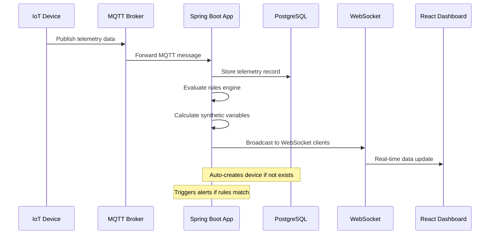
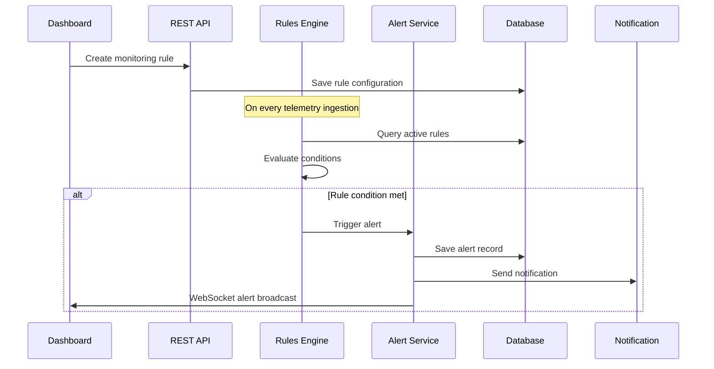
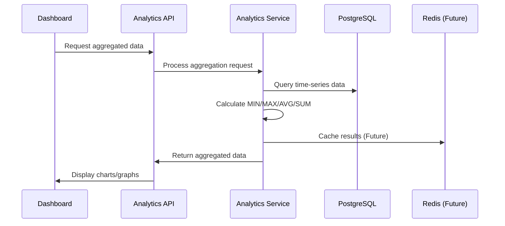
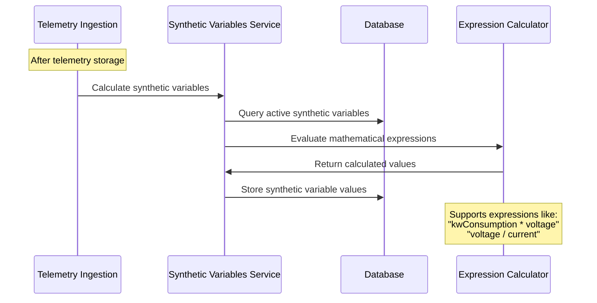

# Industrial Cloud

**The IoT Platform That Scales With You**

Build once, deploy anywhere, scale infinitely. Industrial Cloud is an enterprise-grade IoT monitoring platform built on modern architecture with developer-friendly tools. Get from zero to insights in minutes with real-time data visualization, intelligent alerting, and extensible plugin ecosystem.

## 🚀 Features

### Core Infrastructure
- **MQTT & HTTP REST ingestion** for flexible device connectivity
- **PostgreSQL persistence** with Flyway-managed schema migrations
- **WebSocket real-time streaming** for live dashboard updates
- **Docker-first infrastructure**: Mosquitto and PostgreSQL in a lightweight stack
- **Swagger/OpenAPI documentation** for interactive API testing

### Frontend Dashboard
- **Modern React Web Dashboard** built with Vite and TypeScript
- **Real-time data visualization** with Chart.js and WebSocket integration
- **Device management interface** with CRUD operations
- **Responsive design** with Tailwind CSS
- **Widget-based dashboards** with drag-and-drop functionality

### Device & Data Management
- **Device lifecycle management** with status tracking
- **Device groups & tags** for flexible organization
- **Time-series telemetry storage** with optimized indexing
- **Data aggregation endpoints** (MIN/MAX/AVG/SUM) with time intervals
- **Data export** in CSV and JSON formats
- **Variable management** with rich metadata (units, ranges, colors)
- **RESTful APIs** for all operations
- **Multi-tenant organization** support

### Advanced Analytics & Alerting
- **Rules engine** for conditional monitoring and automation
- **Alert system** with severity levels and acknowledgment
- **Synthetic variables** for derived metrics and calculations
- **Advanced expression engine** with 31 functions:
  - **Math functions** (13): sqrt, pow, abs, log, exp, sin, cos, tan, round, floor, ceil, min, max, clamp
  - **Logic functions** (4): if, and, or, not
  - **Statistical time-series functions** (10): avg, stddev, sum, count, min, max, minTime, maxTime, rate, movingAvg, percentChange, median
  - **Time windows**: 5m, 15m, 1h, 24h, 7d, 30d
- **Historical data analytics** with flexible time ranges
- **Multi-channel notifications** - Email, SMS, Webhook, and In-App
- **Configurable notification preferences** with severity thresholds
- **Global/fleet rules** for monitoring 1,000+ devices simultaneously

### Plugin Marketplace & Extensibility
- **Plugin Marketplace** - Browse, install, and manage plugins via web UI
- **6 Official Plugins** ready for use:
  - **LoRaWAN TTN Integration** - Connect The Things Network v3 devices
  - **Modbus TCP** - Industrial IoT sensor polling
  - **Sigfox Protocol Parser** - Sigfox device callback processing
  - **Slack Notifications** - Send alerts to Slack channels
  - **Discord Notifications** - Discord webhook notifications
  - **HTTP Webhook Receiver** - Generic webhook integration
- **Plugin lifecycle management** - Install, activate, configure, deactivate, uninstall
- **Dynamic configuration UI** - Auto-generated forms from JSON Schema
- **Plugin rating & reviews** - Community feedback system
- **Developer-friendly** - Comprehensive plugin development guide and templates
- **Search & filtering** - Find plugins by category, name, or author

### Security & Access Control
- **Device Token Authentication** - Simple UUID-based API keys for IoT devices (never expires)
- **JWT-based authentication** - Web dashboard and API access with secure token management
- **OAuth 2.0 integration** - Google Sign-In with automatic account creation
- **Role-based access control** (Admin, User, Viewer roles)
- **Multi-tenant architecture** with organization isolation
- **User registration** with automatic organization creation
- **Secure password hashing** with BCrypt
- **Token management** - Generate, rotate, and revoke device tokens via UI
- **Production security** with AWS Security Groups and RDS encryption

### Events & Audit Trail
- **Comprehensive event system** tracking all platform activities
- **Event filtering** by type, severity, device, and time range
- **Event statistics** and analytics dashboards
- **Real-time event notifications** via WebSocket

### Monitoring & Observability
- **Prometheus metrics** collection with Spring Boot Actuator
- **Grafana dashboards** for real-time visualization
- **JVM metrics** - memory, threads, garbage collection
- **HTTP metrics** - request rates, response times, error rates
- **Database metrics** - connection pool, query performance
- **Custom IoT metrics** - device telemetry, MQTT throughput
- **Structured logging** with rolling file appenders
- **Smart meter simulator** for testing and demonstration
- **Real-time connection status** and health monitoring
- **Notification delivery tracking** with success/failure logs
- **Health endpoints** for service monitoring

### 🎯 Official SDKs & Integration Tools

#### Python SDK (`indcloud-sdk`)
Production-ready Python client library for seamless IoT device integration:
- Simple, intuitive API for sending telemetry data
- Configurable retry logic with exponential backoff
- Comprehensive error handling (authentication, validation, rate limiting)
- Type hints and full documentation
- **✅ Available on PyPI**: https://pypi.org/project/indcloud-sdk/

**Installation:**
```bash
pip install indcloud-sdk
```

**Quick Start:**
```python
from indcloud import IndCloudClient

client = IndCloudClient(
    api_url="http://your-server:8080",
    api_key="your-device-token"
)

# Send telemetry data - it's that simple!
client.send_data("my-device-001", {
    "temperature": 23.5,
    "humidity": 65.2
})
```

📚 [Full Python SDK Documentation](indcloud-sdk/README.md)

#### JavaScript/TypeScript SDK (`indcloud-sdk-js`)
Cross-platform SDK for Node.js and browsers with WebSocket support:
- REST client for telemetry ingestion
- Real-time WebSocket subscriptions for live data
- Works in Node.js and browsers (UMD, CommonJS, ES Modules)
- TypeScript definitions included
- Automatic reconnection and retry logic
- **✅ Available on npm**: https://www.npmjs.com/package/indcloud-sdk

**Installation:**
```bash
npm install indcloud-sdk
```

**Quick Start:**
```typescript
import { IndCloudClient, WebSocketClient } from 'indcloud-sdk';

// Send data via REST
const client = new IndCloudClient({
    apiUrl: 'http://your-server:8080',
    apiKey: 'your-device-token'
});

await client.sendData('my-device-001', {
    temperature: 23.5,
    humidity: 65.2
});

// Subscribe to real-time updates via WebSocket
const wsClient = new WebSocketClient({
    wsUrl: 'ws://your-server:8080/ws/telemetry',
    apiKey: 'your-device-token'
});

wsClient.subscribe('my-device-001', (data) => {
    console.log('Received:', data);
});

wsClient.connect();
```

📚 [Full JavaScript SDK Documentation](indcloud-sdk-js/README.md)

#### Java SDK (`indcloud-sdk-java`)
Enterprise-ready Java SDK for industrial IoT and Android devices:
- Type-safe Java API with builder pattern
- Automatic retry logic with exponential backoff
- Comprehensive error handling with specific exception types
- SLF4J logging integration
- Java 17+ support
- Perfect for Spring Boot integration and Android IoT devices

**Installation (Maven):**
```xml
<dependency>
    <groupId>io.indcloud</groupId>
    <artifactId>indcloud-sdk</artifactId>
    <version>0.1.0</version>
</dependency>
```

**Quick Start:**
```java
import io.indcloud.sdk.IndCloudClient;
import java.util.Map;

IndCloudClient client = new IndCloudClient.Builder()
    .apiUrl("http://your-server:8080")
    .apiKey("your-device-token")
    .build();

Map<String, Object> data = Map.of(
    "temperature", 23.5,
    "humidity", 65.2
);

client.sendData("my-device-001", data);
```

📚 [Full Java SDK Documentation](indcloud-sdk-java/README.md)

#### Frontend Integration Wizard
Interactive 5-step wizard for zero-config device onboarding:
- 🎨 Visual step-by-step setup process
- 📝 Live code generation for Python and JavaScript
- 🔑 Smart device token management (auto-detect existing tokens)
- ⚡ Real-time connection testing with WebSocket
- 📋 Copy-to-clipboard for all code snippets
- ✅ Works with both new and existing devices

**Try it now:** Navigate to `/integration-wizard` in the Industrial Cloud dashboard!

📚 [Integration Wizard User Guide](INTEGRATION_WIZARD_GUIDE.md)

## ⚡ 5-Minute Quick Start for IoT Devices

**NEW**: Industrial Cloud now supports ultra-simple device integration! No complex authentication, no manual device registration required.

### For IoT Developers (ESP32, Arduino, Python, etc.)

#### Step 1: Get Your Device API Key
1. Register at http://localhost:3001/register (or production URL)
2. Login to the dashboard
3. Create your first device via the UI
4. Click the **Key icon** (🔑) next to your device
5. Copy the API token (UUID format)

#### Step 2: Send Data (That's It!)

**ESP32/Arduino:**
```cpp
// Install: ArduinoHttpClient library
#include <WiFi.h>
#include <HttpClient.h>

const char* apiKey = "YOUR-DEVICE-API-KEY";  // From Step 1
const char* deviceId = "my-sensor-001";

void loop() {
  float temperature = readSensor();

  // One HTTP POST - device auto-created on first send!
  HttpClient http;
  http.begin("http://YOUR-SERVER:8080/api/v1/ingest/" + String(deviceId));
  http.addHeader("X-API-Key", apiKey);
  http.addHeader("Content-Type", "application/json");

  String payload = "{\"temperature\":" + String(temperature) + "}";
  http.POST(payload);

  delay(60000); // Send every minute
}
```

**Python (Raspberry Pi, PC):**
```python
import requests
import time

API_KEY = "YOUR-DEVICE-API-KEY"  # From Step 1
DEVICE_ID = "my-sensor-001"

while True:
    temperature = read_sensor()

    # One HTTP POST - device auto-created on first send!
    response = requests.post(
        f"http://YOUR-SERVER:8080/api/v1/ingest/{DEVICE_ID}",
        headers={"X-API-Key": API_KEY},
        json={"temperature": temperature}
    )

    time.sleep(60)  # Send every minute
```

**curl (Testing):**
```bash
curl -X POST http://localhost:8080/api/v1/ingest/my-sensor-001 \
  -H "X-API-Key: 550e8400-e29b-41d4-a716-446655440000" \
  -H "Content-Type: application/json" \
  -d '{"temperature": 23.5, "humidity": 65.2}'
```

#### Step 3: View Live Data
Open http://localhost:3001/dashboard and watch your data appear in real-time! 🎉

**That's it!** No JWT complexity, no manual device registration, no nested JSON payloads. Perfect for IoT devices.

---

## Full Platform Quick Start

### Prerequisites

- Java 17+
- Docker Desktop
- Git

### 1. Clone and Setup

```bash
git clone <your-repo-url>
cd indcloud
```

### 2. Start Infrastructure Services

```bash
# Start PostgreSQL and MQTT broker
docker-compose up -d
```

### 3. Run the Application

```bash
# On Windows PowerShell (use .\ prefix)
.\gradlew.bat bootRun

# On Windows Command Prompt
gradlew.bat bootRun

# On Linux/Mac
./gradlew bootRun
```

### 4. Start the Frontend

```bash
cd frontend
npm install
npm run dev
```

### 5. Access the Services

**Local Development:**
- **🌟 Industrial Cloud Dashboard**: http://localhost:3001 (React Web UI)
- **📚 Swagger API Documentation**: http://localhost:8080/swagger-ui.html
- **Backend API**: http://localhost:8080/api/v1/*
- **MQTT Broker**: localhost:1883

**Production Deployment (AWS):**
- **🌟 Industrial Cloud Application**: http://54.149.190.208.nip.io:8080
- **📊 Grafana Monitoring**: http://54.149.190.208.nip.io:3000 (admin/admin)
- **📈 Prometheus Metrics**: http://54.149.190.208.nip.io:9090
- **Backend API**: http://54.149.190.208.nip.io:8080/api/v1/*
- **MQTT Broker**: 54.149.190.208:1883

### 6. First Time Setup

1. Register a new account at http://localhost:3001/register
2. Login with your credentials
3. The simulator will auto-create 10 test devices
4. Explore the dashboard and test the new features!

## 🏗️ Architecture Overview

### System Architecture
```
┌─────────────┐  MQTT/HTTP  ┌─────────────────┐    WebSocket    ┌─────────────────┐
│ IoT Devices │─────────────>│   Spring Boot   │<───────────────>│   React Web     │
└─────────────┘             │   Application   │                 │   Dashboard     │
                            └─────────────────┘                 └─────────────────┘
                                     │
                                     ▼
┌─────────────┐              ┌─────────────────┐              ┌─────────────────┐
│ PostgreSQL  │<─────────────│  Data Pipeline  │─────────────>│ Custom Widgets  │
│ Time-Series │              │  & Processing   │              │ & Dashboards    │
└─────────────┘              └─────────────────┘              └─────────────────┘
                                     │
                                     ▼
                             ┌─────────────────┐
                             │ Rules Engine &  │
                             │ Alert System    │
                             └─────────────────┘
```

### Data Flow Architecture
```
MQTT Message Ingestion → Device Management → Telemetry Storage
         │                                           │
         ▼                                           ▼
WebSocket Broadcasting ← Real-time Dashboard    Rules Engine
         │                                           │
         ▼                                           ▼
  Live Visualization                           Alert Generation
                                                     │
                                                     ▼
                                            Notification System
```

## IoT Data Simulation

The built-in simulator publishes synthetic smart meter telemetry when `simulator.enabled=true`:

- **10 simulated devices** by default (configurable)
- **Time-of-day consumption curves** with random jitter
- **Multiple metrics**: kW, voltage, current, power factor, frequency
- **30-second cadence** (configurable)

To disable the simulator, set `SIMULATOR_ENABLED=false` or toggle the property in `application.yml`.

## 🆕 New Features

### HTTP REST Data Ingestion
In addition to MQTT, devices can now send telemetry via HTTP REST API:

```bash
# Full telemetry ingestion
curl -X POST http://localhost:8080/api/v1/data/ingest \
  -H "Content-Type: application/json" \
  -d '{
    "deviceId": "sensor-001",
    "variables": {
      "temperature": 23.5,
      "humidity": 65.2
    }
  }'

# Single variable ingestion
curl -X POST http://localhost:8080/api/v1/data/sensor-001/temperature \
  -H "Content-Type: application/json" \
  -d "23.5"
```

### Device Groups & Tags
Organize devices with flexible grouping and color-coded tags:
- Create groups like "Building A Sensors" or "Production Line 1"
- Add tags with custom colors for quick filtering
- Store custom properties per device

### Data Export
Export historical telemetry data:

```bash
# CSV export
curl "http://localhost:8080/api/v1/export/csv/sensor-001?from=2024-01-01T00:00:00Z&to=2024-01-31T23:59:59Z" \
  -o data.csv

# JSON export
curl "http://localhost:8080/api/v1/export/json/sensor-001?from=2024-01-01T00:00:00Z&to=2024-01-31T23:59:59Z" \
  -o data.json
```

### Variable Management
Define variables with rich metadata:
- Display names and descriptions
- Units (kW, °C, V, etc.)
- Min/max value constraints
- Custom colors and icons
- Decimal precision control

### Dashboard Sharing
Share dashboards with team members or publicly:
- Generate public share links
- Set user permissions (VIEW, EDIT, ADMIN)
- Configure expiration dates
- Track dashboard access logs

### Interactive API Documentation
Explore and test all APIs at: **http://localhost:8080/swagger-ui.html**

## 🔧 API Examples

### Authentication

```bash
# Register a new user and organization
curl -X POST http://localhost:8080/api/v1/auth/register \
  -H "Content-Type: application/json" \
  -d '{
    "username": "john.doe",
    "email": "john@example.com",
    "password": "SecurePass123!",
    "firstName": "John",
    "lastName": "Doe",
    "organizationName": "My IoT Company"
  }'

# Login and get JWT token
curl -X POST http://localhost:8080/api/v1/auth/login \
  -H "Content-Type: application/json" \
  -d '{
    "username": "john.doe",
    "password": "SecurePass123!"
  }'

# Use the token in subsequent requests
curl -H "Authorization: Bearer YOUR_JWT_TOKEN" \
  http://localhost:8080/api/v1/devices
```

### Device Management

```bash
# Get all devices
curl http://localhost:8080/api/v1/devices

# Create a new device
curl -X POST http://localhost:8080/api/v1/devices \
  -H "Content-Type: application/json" \
  -d '{
    "externalId": "sensor-001",
    "name": "Temperature Sensor",
    "location": "Building A",
    "sensorType": "temperature"
  }'

# Update a device
curl -X PUT http://localhost:8080/api/v1/devices/sensor-001 \
  -H "Content-Type: application/json" \
  -d '{"name": "Updated Sensor Name"}'
```

### Telemetry Data

```bash
# Query historical data
curl "http://localhost:8080/api/v1/data/query?deviceId=meter-001&from=2024-01-01T00:00:00Z&to=2024-01-02T00:00:00Z"

# Get latest values for multiple devices
curl "http://localhost:8080/api/v1/data/latest?deviceIds=meter-001,meter-002"

# Get latest value for single device
curl http://localhost:8080/api/v1/data/latest/meter-001
```

### Analytics & Aggregation

```bash
# Get aggregated data (hourly averages)
curl "http://localhost:8080/api/v1/analytics/aggregate?deviceId=meter-001&variable=kwConsumption&aggregation=AVG&from=2024-01-01T00:00:00Z&to=2024-01-02T00:00:00Z&interval=1h"

# Get daily maximum values
curl "http://localhost:8080/api/v1/analytics/aggregate?deviceId=meter-001&variable=voltage&aggregation=MAX&from=2024-01-01T00:00:00Z&to=2024-01-31T00:00:00Z&interval=1d"
```

### Rules Management

```bash
# Get all rules
curl http://localhost:8080/api/v1/rules

# Create a new rule
curl -X POST http://localhost:8080/api/v1/rules \
  -H "Content-Type: application/json" \
  -d '{
    "name": "High Power Alert",
    "description": "Alert when power consumption exceeds 100kW",
    "deviceId": "meter-001",
    "variable": "kwConsumption",
    "operator": "GT",
    "threshold": 100.0,
    "enabled": true
  }'

# Update a rule
curl -X PUT http://localhost:8080/api/v1/rules/{ruleId} \
  -H "Content-Type: application/json" \
  -d '{"enabled": false}'
```

### Alerts Management

```bash
# Get all alerts
curl -H "Authorization: Bearer YOUR_JWT_TOKEN" \
  http://localhost:8080/api/v1/alerts

# Get only unacknowledged alerts
curl -H "Authorization: Bearer YOUR_JWT_TOKEN" \
  "http://localhost:8080/api/v1/alerts?unacknowledgedOnly=true"

# Acknowledge an alert
curl -X POST \
  -H "Authorization: Bearer YOUR_JWT_TOKEN" \
  http://localhost:8080/api/v1/alerts/{alertId}/acknowledge
```

### Notification Management

```bash
# Get notification preferences
curl -H "Authorization: Bearer YOUR_JWT_TOKEN" \
  http://localhost:8080/api/v1/notifications/preferences

# Configure email notifications
curl -X POST \
  -H "Authorization: Bearer YOUR_JWT_TOKEN" \
  -H "Content-Type: application/json" \
  -d '{
    "channel": "EMAIL",
    "enabled": true,
    "destination": "alerts@example.com",
    "minSeverity": "HIGH",
    "immediate": true
  }' \
  http://localhost:8080/api/v1/notifications/preferences

# Configure SMS notifications
curl -X POST \
  -H "Authorization: Bearer YOUR_JWT_TOKEN" \
  -H "Content-Type: application/json" \
  -d '{
    "channel": "SMS",
    "enabled": true,
    "destination": "+1234567890",
    "minSeverity": "CRITICAL",
    "immediate": true
  }' \
  http://localhost:8080/api/v1/notifications/preferences

# Get notification history
curl -H "Authorization: Bearer YOUR_JWT_TOKEN" \
  "http://localhost:8080/api/v1/notifications/logs?page=0&size=20"

# Get notification statistics
curl -H "Authorization: Bearer YOUR_JWT_TOKEN" \
  http://localhost:8080/api/v1/notifications/stats

# Delete a notification channel
curl -X DELETE \
  -H "Authorization: Bearer YOUR_JWT_TOKEN" \
  http://localhost:8080/api/v1/notifications/preferences/EMAIL
```

### Events & Audit Trail

```bash
# Get all events with filters
curl -H "Authorization: Bearer YOUR_JWT_TOKEN" \
  "http://localhost:8080/api/v1/events?page=0&size=50"

# Filter by event type
curl -H "Authorization: Bearer YOUR_JWT_TOKEN" \
  "http://localhost:8080/api/v1/events?eventType=ALERT_CREATED&severity=CRITICAL"

# Get recent events (last 24 hours)
curl -H "Authorization: Bearer YOUR_JWT_TOKEN" \
  "http://localhost:8080/api/v1/events/recent?hours=24"

# Get event statistics by type
curl -H "Authorization: Bearer YOUR_JWT_TOKEN" \
  "http://localhost:8080/api/v1/events/statistics/by-type?hours=24"

# Get event statistics by severity
curl -H "Authorization: Bearer YOUR_JWT_TOKEN" \
  "http://localhost:8080/api/v1/events/statistics/by-severity?hours=24"
```

## MQTT Topics

- `indcloud/devices/{deviceId}/telemetry` � Telemetry messages
- `indcloud/devices/{deviceId}/status` � Device status updates (reserved)
- `indcloud/devices/{deviceId}/commands` � Command channel to devices

### Sample Telemetry Message

```json
{
  "deviceId": "meter-001",
  "timestamp": "2024-01-15T10:30:00Z",
  "variables": {
    "kw_consumption": 125.5,
    "voltage": 220.1,
    "current": 0.57,
    "power_factor": 0.92,
    "frequency": 50.02
  },
  "metadata": {
    "location": "Building A - Floor 1",
    "sensor_type": "smart_meter",
    "firmware_version": "2.1.0"
  }
}
```

## Configuration

Key configuration options live in `src/main/resources/application.yml`:

```yaml
mqtt:
  broker:
    url: tcp://localhost:1883
    username: indcloud
    password: indcloud123

simulator:
  enabled: true
  device-count: 10
  interval-seconds: 30

spring:
  datasource:
    url: jdbc:postgresql://localhost:5432/indcloud
    username: indcloud
    password: indcloud123
```

Override any property with environment variables (e.g., `SPRING_DATASOURCE_URL`).

## Monitoring & Dashboards

### Prometheus

Metrics are exposed at `/actuator/prometheus` and include:

- `mqtt_messages_total` � MQTT messages processed
- `iot_kw_consumption`, `iot_voltage`, `iot_current` � Distribution summaries of telemetry values
- `iot_device_status{deviceId=...,status="ONLINE"}` � Gauge indicating last seen state per device
- JVM, HTTP, and system metrics provided by Spring Boot Actuator

### Grafana

Access Grafana at http://localhost:3000 (admin/admin123). Provisioned dashboards include:

- Real-time power consumption trends
- Device availability overview
- MQTT ingestion throughput

Dashboards and data sources are provisioned from `ops/grafana` for easy customization.

## 🎯 Use Case Flow Diagrams

### 1. Device Registration & Telemetry Flow


### 2. Rule-Based Alerting Flow


### 3. Analytics & Aggregation Flow


### 4. Synthetic Variables (Derived Metrics) Flow


## 🛠️ Development Guide

### Project Structure

```
├── src/main/java/org/indcloud/
│   ├── controller/          # REST API controllers
│   │   ├── AuthController.java
│   │   ├── DeviceController.java
│   │   ├── TelemetryController.java
│   │   ├── RuleController.java
│   │   ├── AlertController.java
│   │   ├── AnalyticsController.java
│   │   ├── DashboardController.java
│   │   ├── EventController.java
│   │   └── NotificationController.java
│   ├── service/             # Business logic services
│   │   ├── UserService.java
│   │   ├── DeviceService.java
│   │   ├── TelemetryService.java
│   │   ├── TelemetryIngestionService.java
│   │   ├── RuleEngineService.java
│   │   ├── AlertService.java
│   │   ├── AnalyticsService.java
│   │   ├── SyntheticVariableService.java
│   │   ├── DashboardService.java
│   │   ├── EventService.java
│   │   ├── NotificationService.java
│   │   ├── EmailNotificationService.java
│   │   └── SmsNotificationService.java
│   ├── model/               # JPA entities
│   │   ├── User.java
│   │   ├── Organization.java
│   │   ├── Device.java
│   │   ├── TelemetryRecord.java
│   │   ├── Rule.java
│   │   ├── Alert.java
│   │   ├── SyntheticVariable.java
│   │   ├── Dashboard.java
│   │   ├── Widget.java
│   │   ├── Event.java
│   │   ├── UserNotificationPreference.java
│   │   └── NotificationLog.java
│   ├── repository/          # Spring Data repositories
│   ├── security/            # Security configuration & JWT
│   ├── websocket/           # WebSocket handling
│   ├── mqtt/                # MQTT message handling
│   ├── simulator/           # Smart meter simulator
│   ├── config/              # Spring configuration
│   └── dto/                 # Data transfer objects
├── frontend/                # React TypeScript frontend
│   ├── src/
│   │   ├── components/      # Reusable UI components
│   │   │   ├── Layout.tsx
│   │   │   ├── ProtectedRoute.tsx
│   │   │   └── RealTimeChart.tsx
│   │   ├── pages/          # Page-level components
│   │   │   ├── Login.tsx
│   │   │   ├── Register.tsx
│   │   │   ├── Dashboard.tsx
│   │   │   ├── Dashboards.tsx
│   │   │   ├── Devices.tsx
│   │   │   ├── Analytics.tsx
│   │   │   ├── Rules.tsx
│   │   │   ├── Alerts.tsx
│   │   │   ├── Events.tsx
│   │   │   └── Notifications.tsx
│   │   ├── contexts/       # React contexts (Auth)
│   │   ├── services/       # API client services
│   │   ├── hooks/          # Custom React hooks
│   │   └── types/          # TypeScript type definitions
│   └── package.json
└── src/main/resources/
    └── db/migration/        # Flyway database migrations
        ├── V1__Initial_schema.sql
        ├── V2__Add_rules_and_alerts.sql
        ├── V3__Add_synthetic_variables.sql
        ├── V4__Add_dashboards_and_widgets.sql
        ├── V5__Add_users_and_organizations.sql
        ├── V6__Add_user_roles.sql
        ├── V7__Add_events.sql
        └── V8__Add_notifications.sql
```

### Database Schema Overview

```sql
-- Authentication & Authorization
users                          # User accounts
organizations                  # Multi-tenant organizations
user_roles                     # User role assignments

-- Core IoT entities
devices                        # IoT device registry
telemetry_records             # Time-series sensor data

-- Rules & Alerting
rules                          # Monitoring rules/conditions
alerts                         # Triggered alert records

-- Analytics & Dashboards
synthetic_variables            # Calculated metric definitions
synthetic_variable_values      # Computed synthetic values
dashboards                     # Custom dashboard configurations
widgets                        # Dashboard widget definitions

-- Notifications
user_notification_preferences  # User notification settings
notification_logs              # Notification delivery history

-- Audit & Events
events                         # System-wide event log
```

### Key Technologies Used

| Component | Technology | Purpose |
|-----------|-----------|---------|
| **Backend** | Spring Boot 3.3 | REST API and business logic |
| **Database** | PostgreSQL 15 | Time-series data storage |
| **Messaging** | MQTT (Eclipse Mosquitto) | IoT device communication |
| **Real-time** | WebSocket | Live dashboard updates |
| **Frontend** | React 18 + TypeScript | Modern web interface |
| **Build Tool** | Vite | Fast frontend development |
| **Styling** | Tailwind CSS | Responsive UI design |
| **Charts** | Chart.js + react-chartjs-2 | Data visualization |
| **Monitoring** | Prometheus + Grafana | System observability |

### Testing Strategy

```bash
# Run all tests
./gradlew test

# Run tests with coverage
./gradlew test jacocoTestReport

# Frontend tests
cd frontend
npm test
```

## 🚀 Deployment

### Docker Deployment

```bash
# Build the application
./gradlew build

# Build Docker image
docker build -t indcloud-app .

# Start all services
docker-compose up --build

# Start frontend separately
cd frontend && npm run build
# Serve the built frontend with your preferred web server
```

### Production Deployment Checklist

#### Security Hardening
- [ ] Configure MQTT authentication and authorization
- [ ] Enable TLS/SSL for all communications (MQTT, HTTP, WebSocket)
- [ ] Set up proper firewall rules
- [ ] Use environment variables for secrets
- [ ] Implement API rate limiting
- [ ] Set up CORS properly for production domains

#### Database & Performance
- [ ] Configure PostgreSQL connection pooling
- [ ] Set up database backups (WAL archiving)
- [ ] Configure time-series data partitioning
- [ ] Add Redis for caching (future enhancement)
- [ ] Optimize database indexes for your query patterns

#### Monitoring & Observability
- [ ] Configure log aggregation (ELK stack, Loki)
- [ ] Set up application performance monitoring (APM)
- [ ] Configure alerting for system metrics
- [ ] Set up health checks for all services
- [ ] Monitor WebSocket connection health

#### Scalability
- [ ] Use container orchestration (Kubernetes, Docker Swarm)
- [ ] Configure horizontal pod autoscaling
- [ ] Set up load balancing for multiple app instances
- [ ] Implement database read replicas
- [ ] Consider MQTT broker clustering

### Environment Variables

```bash
# Database Configuration
SPRING_DATASOURCE_URL=jdbc:postgresql://localhost:5432/indcloud
SPRING_DATASOURCE_USERNAME=indcloud
SPRING_DATASOURCE_PASSWORD=your_secure_password

# MQTT Configuration
MQTT_BROKER_URL=tcp://localhost:1883
MQTT_BROKER_USERNAME=indcloud
MQTT_BROKER_PASSWORD=your_mqtt_password

# Simulator Configuration
SIMULATOR_ENABLED=true
SIMULATOR_DEVICE_COUNT=10
SIMULATOR_INTERVAL_SECONDS=30

# Frontend Configuration
VITE_API_BASE_URL=http://localhost:8080
VITE_WS_URL=ws://localhost:8080/ws/telemetry
```

## 🔧 Troubleshooting

### Common Issues

#### Backend Issues

| Issue | Symptoms | Solution |
|-------|----------|----------|
| **MQTT Connection Failed** | No telemetry data ingestion | Check MQTT broker is running: `docker-compose ps` |
| **Database Connection Error** | App fails to start | Verify PostgreSQL container: `docker-compose logs postgres` |
| **WebSocket Not Working** | No real-time updates | Check WebSocket endpoint: `ws://localhost:8080/ws/telemetry` |
| **Rules Not Triggering** | Alerts not generated | Check rule configuration and telemetry data types |
| **High Memory Usage** | OutOfMemoryError | Increase JVM heap size: `-Xmx2g` |

#### Frontend Issues

| Issue | Symptoms | Solution |
|-------|----------|----------|
| **White Screen** | React app not loading | Check browser console for errors |
| **API Calls Failing** | Data not displaying | Verify backend is running on port 8080 |
| **WebSocket Connection Failed** | No live data | Check CORS settings and WebSocket URL |
| **Build Errors** | npm run build fails | Clear node_modules and reinstall: `rm -rf node_modules && npm install` |

#### Data Issues

| Issue | Symptoms | Solution |
|-------|----------|----------|
| **No Telemetry Data** | Empty charts/graphs | Enable simulator: `simulator.enabled=true` |
| **Synthetic Variables Not Calculating** | Missing derived metrics | Check expression syntax in synthetic variable definitions |
| **Aggregation Queries Slow** | Timeout errors | Add database indexes or reduce time range |
| **Alert Spam** | Too many alerts | Increase rule evaluation cooldown period |

### Debug Commands

```bash
# View all service logs
docker-compose logs -f

# View specific service logs
docker-compose logs -f postgres
docker-compose logs -f mosquitto

# Backend debug logging
./gradlew bootRun --args='--logging.level.org.indcloud=DEBUG'

# Check database connectivity
docker exec -it indcloud-postgres psql -U indcloud -d indcloud

# Test MQTT connectivity
mosquitto_pub -h localhost -p 1883 -t "indcloud/devices/test-001/telemetry" -m '{"deviceId":"test-001","timestamp":"2024-01-01T12:00:00Z","variables":{"kw_consumption":50.5}}'

# Frontend debug mode
cd frontend && npm run dev -- --debug

# Check WebSocket connection
wscat -c ws://localhost:8080/ws/telemetry
```

### Performance Tuning

#### Database Optimization
```sql
-- Add indexes for common queries
CREATE INDEX CONCURRENTLY IF NOT EXISTS idx_telemetry_device_time_desc
ON telemetry_records (device_id, measurement_timestamp DESC);

CREATE INDEX CONCURRENTLY IF NOT EXISTS idx_alerts_unacknowledged
ON alerts (acknowledged, created_at DESC) WHERE NOT acknowledged;

-- Analyze table statistics
ANALYZE telemetry_records;
ANALYZE devices;
ANALYZE rules;
ANALYZE alerts;
```

#### Application Tuning
```yaml
# application.yml optimizations
spring:
  datasource:
    hikari:
      maximum-pool-size: 20
      minimum-idle: 5
      idle-timeout: 300000
  jpa:
    hibernate:
      jdbc:
        batch_size: 100
    properties:
      hibernate:
        order_inserts: true
        order_updates: true
        jdbc.batch_versioned_data: true
```

## 🤝 Contributing

We welcome contributions! Here's how to get started:

### Development Setup

1. **Fork and Clone**
   ```bash
   git clone https://github.com/your-username/indcloud.git
   cd indcloud
   ```

2. **Backend Setup**
   ```bash
   ./gradlew build
   docker-compose up -d postgres mosquitto
   ./gradlew bootRun
   ```

3. **Frontend Setup**
   ```bash
   cd frontend
   npm install
   npm run dev
   ```

### Contribution Guidelines

1. 🍴 Fork the repository
2. 🌿 Create a feature branch (`git checkout -b feature/amazing-feature`)
3. 📝 Write tests for your changes
4. ✅ Ensure all tests pass (`./gradlew test && cd frontend && npm test`)
5. 📋 Update documentation if needed
6. 🚀 Create a pull request

### Code Standards

- Follow existing code style and conventions
- Add JavaDoc comments for public methods
- Write unit tests for new functionality
- Update README for significant changes
- Use meaningful commit messages

Refer to [Repository Guidelines](AGENTS.md) for detailed development guidelines.

## 📊 Current vs Ubidots Feature Comparison

| Feature | Industrial Cloud | Ubidots | Status |
|---------|-------------|---------|---------|
| Device Management | ✅ | ✅ | Complete |
| Real-time Dashboard | ✅ | ✅ | Complete |
| Widget Dashboards | ✅ | ✅ | Complete |
| Data Visualization | ✅ | ✅ | Complete |
| Rules Engine | ✅ | ✅ | Complete |
| Alerting System | ✅ | ✅ | Complete |
| Data Aggregation | ✅ | ✅ | Complete |
| WebSocket Streaming | ✅ | ✅ | Complete |
| Synthetic Variables | ✅ | ✅ | Complete |
| User Authentication | ✅ | ✅ | Complete |
| Multi-tenancy | ✅ | ✅ | Complete |
| Role-based Access | ✅ | ✅ | Complete |
| Email Notifications | ✅ | ✅ | Complete (stub) |
| SMS Notifications | ✅ | ✅ | Complete (stub) |
| Webhook Notifications | 🔶 | ✅ | Partial |
| Events & Audit Trail | ✅ | ✅ | Complete |
| Multi-Protocol Support | 🔶 MQTT Only | ✅ HTTP/MQTT/TCP/UDP | Future |
| Mobile Apps | ❌ | ✅ | Future |
| Machine Learning | ❌ | ✅ | Future |
| Geolocation/Maps | ❌ | ✅ | Future |
| Data Export | ❌ | ✅ | Future |

**Legend:** ✅ Complete | 🔶 Partial | ❌ Not Implemented

## 🎉 Q1 2025 Release - Feature Parity Milestone

**Release Date**: November 2025
**Version**: 1.6.0
**Achievement**: 80% Feature Parity with Ubidots ✅

### Sprint 4 Phase 2: Advanced Expression Engine ✅
**31 Total Functions** - Powerful analytics and data transformations

**Mathematical Functions (13)**:
- Basic math: `sqrt`, `pow`, `abs`, `round`, `floor`, `ceil`
- Advanced math: `log`, `exp`, `sin`, `cos`, `tan`
- Utilities: `min`, `max`, `clamp`

**Logic Functions (4)**:
- Conditional: `if(condition, trueValue, falseValue)`
- Boolean: `and`, `or`, `not`

**Statistical Time-Series Functions (10)** - NEW! ⚡
- Aggregations: `avg(variable, timeWindow)`, `sum`, `count`, `min`, `max`
- Statistics: `stddev`, `median`
- Time-based: `minTime`, `maxTime`, `rate`, `movingAvg`, `percentChange`
- **Time windows**: 5m, 15m, 1h, 24h, 7d, 30d

**Real-World Use Cases**:
```javascript
// Spike detection
if(kwConsumption > avg("kwConsumption", "1h") * 1.5, 1, 0)

// Anomaly detection
if(abs(voltage - avg("voltage", "1h")) > stddev("voltage", "1h") * 2, 1, 0)

// Daily energy totals
sum("kwConsumption", "24h")

// Week-over-week growth
percentChange("kwConsumption", "7d")
```

### Sprint 6: Plugin Marketplace MVP ✅
**Extensible Plugin Ecosystem** - 6 Official Plugins at Launch

**Backend (100% Complete)**:
- Database schema: V50, V51 migrations
- 10 REST API endpoints
- 39/39 tests passing (100% pass rate)
- Plugin lifecycle management (install, activate, deactivate, uninstall)
- JSON Schema-based configuration validation

**Frontend (80% Complete)**:
- Plugin Marketplace page with search & filtering
- Dynamic configuration forms (auto-generated from JSON Schema)
- Plugin details modal with screenshots and metadata
- One-click installation workflow
- Rating and review system

**Official Plugins**:
1. **LoRaWAN TTN Integration** - The Things Network v3 protocol parser
2. **Modbus TCP** - Industrial sensor polling (holding/input registers)
3. **Sigfox Protocol Parser** - Sigfox callback processing
4. **Slack Notifications** - Rich Slack alert messages
5. **Discord Notifications** - Discord webhook with embeds
6. **HTTP Webhook Receiver** - Generic webhook integration

**Developer Resources**:
- [Plugin Development Guide](docs/PLUGIN_DEVELOPMENT_GUIDE.md) - 600+ line comprehensive guide
- [Example Plugin Template](docs/examples/EXAMPLE_PLUGIN_TEMPLATE.md) - Copy-paste starter code
- [API Documentation](docs/api/PLUGIN_MARKETPLACE_API.md) - Complete REST API reference
- [User Guide](docs/user-guides/PLUGIN_MARKETPLACE_USER_GUIDE.md) - End-user documentation

**Test Coverage**:
- 130+ tests across all Q1 sprints
- 98.5% pass rate (128/130 tests)
- 0 production bugs

---

## 🔮 Feature Roadmap

### Phase 1 - Core Platform ✅ COMPLETE
- [x] MQTT ingestion pipeline
- [x] Real-time web dashboard
- [x] Device management
- [x] Rules engine & alerting
- [x] Data aggregation & analytics
- [x] Synthetic variables
- [x] Widget-based dashboards

### Phase 2 - Authentication & Security ✅ COMPLETE
- [x] JWT-based authentication
- [x] Role-based access control (Admin, User, Viewer)
- [x] Multi-tenant architecture
- [x] Organization isolation
- [x] User registration & management
- [ ] API rate limiting
- [ ] HTTPS/WSS enforcement

### Phase 3 - Advanced Alerting ✅ COMPLETE
- [x] Multi-channel notifications (Email, SMS, Webhook, In-App)
- [x] Configurable notification preferences
- [x] Severity-based filtering
- [x] Immediate vs digest delivery
- [x] Notification history & tracking
- [x] Events & audit trail system
- [ ] Slack/Teams integration
- [ ] PagerDuty integration

### Phase 4 - Extended Protocol Support 🔄 PLANNED
- [ ] HTTP REST data ingestion
- [ ] TCP/UDP protocol support
- [ ] CoAP protocol support
- [ ] LoRaWAN integration
- [ ] Zigbee/Z-Wave support

### Phase 5 - Advanced Features 🔄 PLANNED
- [ ] Geolocation & map widgets
- [ ] Device groups & tagging
- [ ] Data export/import (CSV, JSON, Excel)
- [ ] Machine learning anomaly detection
- [ ] Predictive maintenance algorithms
- [ ] Mobile app (React Native)
- [ ] Scheduled reports

### Phase 6 - Enterprise Features 🔄 PLANNED
- [ ] White-label customization
- [ ] Advanced user permissions
- [ ] Team/department hierarchies
- [ ] Data retention policies
- [ ] Custom plugin system
- [ ] Advanced analytics & BI integration
- [ ] SSO/SAML authentication

## 📄 License

This project is licensed under the MIT License - see the [LICENSE](LICENSE) file for details.

## 🙏 Acknowledgments

- **Ubidots** for inspiration and feature reference
- **Spring Boot** community for excellent documentation
- **React** and **Vite** teams for modern frontend tools
- **PostgreSQL** for reliable time-series data storage
- **MQTT** community for IoT messaging standards

---

<div align="center">
  <h3>🌟 Industrial Cloud - Bringing Intelligence to IoT Monitoring 🌟</h3>
  <p><i>A modern, open-source alternative to commercial IoT platforms</i></p>

  **[🚀 Get Started](#quick-start) | [📖 Documentation](#architecture-overview) | [🤝 Contribute](#contributing) | [💬 Discussions](https://github.com/your-repo/discussions)**
</div>
