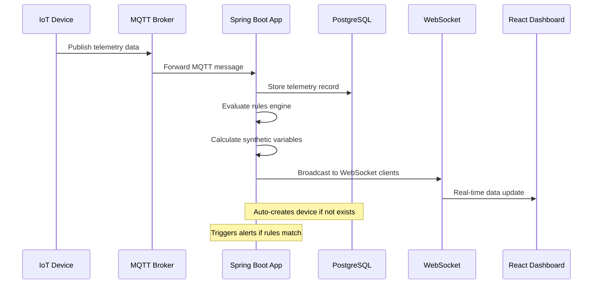
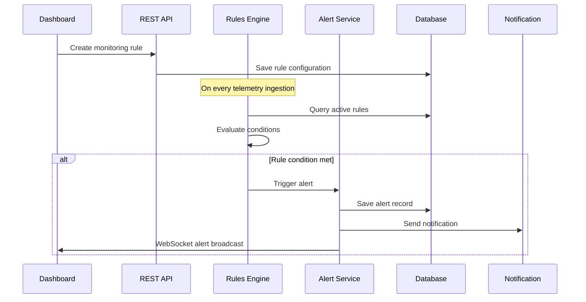
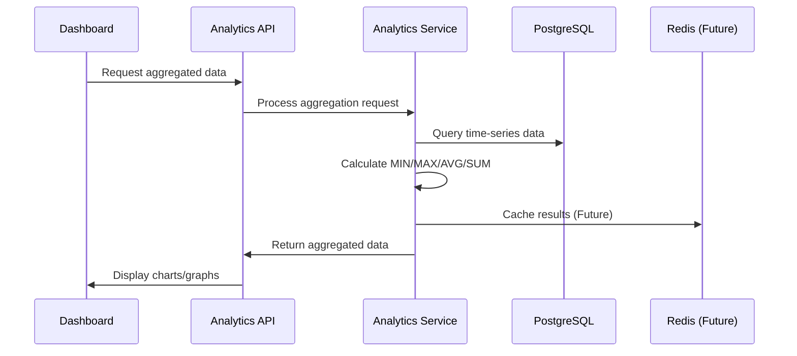
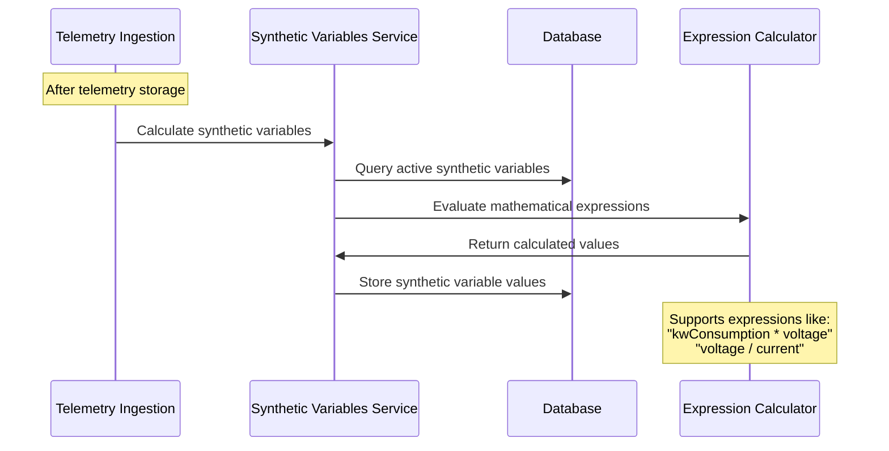

# SensorVision IoT Monitoring Platform

A comprehensive Ubidots-like IoT monitoring platform built on Spring Boot and MQTT that provides complete device management, real-time data visualization, alerting, and analytics capabilities.

## 🚀 Features

### Core Infrastructure
- **MQTT ingestion pipeline** built with Spring Integration and Eclipse Paho
- **PostgreSQL persistence** with Flyway-managed schema migrations
- **WebSocket real-time streaming** for live dashboard updates
- **Docker-first infrastructure**: Mosquitto, PostgreSQL, Prometheus, and Grafana in one stack

### Frontend Dashboard
- **Modern React Web Dashboard** built with Vite and TypeScript
- **Real-time data visualization** with Chart.js and WebSocket integration
- **Device management interface** with CRUD operations
- **Responsive design** with Tailwind CSS

### Device & Data Management
- **Device lifecycle management** with status tracking
- **Time-series telemetry storage** with optimized indexing
- **Data aggregation endpoints** (MIN/MAX/AVG/SUM) with time intervals
- **RESTful APIs** for all operations

### Advanced Analytics
- **Rules engine** for conditional monitoring and automation
- **Alert system** with severity levels and acknowledgment
- **Synthetic variables** for derived metrics and calculations
- **Historical data analytics** with flexible time ranges

### Monitoring & Observability
- **Prometheus metrics** exposed via Spring Boot Actuator
- **Grafana dashboards** provisioned automatically
- **Smart meter simulator** for testing and demonstration
- **Real-time connection status** and health monitoring

## Quick Start

### Prerequisites

- Java 17+
- Docker Desktop
- Git

### 1. Clone and Setup

```bash
git clone <your-repo-url>
cd sensorvision
```

### 2. Start Infrastructure Services

```bash
# Start PostgreSQL, MQTT broker, Prometheus, and Grafana
docker-compose up -d
```

### 3. Run the Application

```bash
# On Windows
gradlew.bat bootRun

# On Linux/Mac
./gradlew bootRun
```

### 4. Start the Frontend (New!)

```bash
cd frontend
npm install
npm run dev
```

### 5. Access the Services

- **🌟 SensorVision Dashboard**: http://localhost:3001 (New React UI!)
- **Backend API**: http://localhost:8080/api/v1/devices
- **Grafana Dashboard**: http://localhost:3000 (admin/admin123)
- **Prometheus Metrics**: http://localhost:9090
- **MQTT Broker**: localhost:1883

## 🏗️ Architecture Overview

### System Architecture
```
┌─────────────┐    MQTT     ┌─────────────────┐    WebSocket    ┌─────────────────┐
│ IoT Devices │─────────────>│   Spring Boot   │<───────────────>│   React Web     │
└─────────────┘             │   Application   │                 │   Dashboard     │
                            └─────────────────┘                 └─────────────────┘
                                     │
                                     ▼
┌─────────────┐              ┌─────────────────┐              ┌─────────────────┐
│ PostgreSQL  │<─────────────│  Data Pipeline  │─────────────>│   Prometheus    │
│ Database    │              │  & Processing   │              │   & Grafana     │
└─────────────┘              └─────────────────┘              └─────────────────┘
                                     │
                                     ▼
                             ┌─────────────────┐
                             │ Rules Engine &  │
                             │ Alert System    │
                             └─────────────────┘
```

### Data Flow Architecture
```
MQTT Message Ingestion → Device Management → Telemetry Storage
         │                                           │
         ▼                                           ▼
WebSocket Broadcasting ← Real-time Dashboard    Rules Engine
         │                                           │
         ▼                                           ▼
  Live Visualization                           Alert Generation
                                                     │
                                                     ▼
                                            Notification System
```

## IoT Data Simulation

The built-in simulator publishes synthetic smart meter telemetry when `simulator.enabled=true`:

- **10 simulated devices** by default (configurable)
- **Time-of-day consumption curves** with random jitter
- **Multiple metrics**: kW, voltage, current, power factor, frequency
- **30-second cadence** (configurable)

To disable the simulator, set `SIMULATOR_ENABLED=false` or toggle the property in `application.yml`.

## 🔧 API Examples

### Device Management

```bash
# Get all devices
curl http://localhost:8080/api/v1/devices

# Create a new device
curl -X POST http://localhost:8080/api/v1/devices \
  -H "Content-Type: application/json" \
  -d '{
    "externalId": "sensor-001",
    "name": "Temperature Sensor",
    "location": "Building A",
    "sensorType": "temperature"
  }'

# Update a device
curl -X PUT http://localhost:8080/api/v1/devices/sensor-001 \
  -H "Content-Type: application/json" \
  -d '{"name": "Updated Sensor Name"}'
```

### Telemetry Data

```bash
# Query historical data
curl "http://localhost:8080/api/v1/data/query?deviceId=meter-001&from=2024-01-01T00:00:00Z&to=2024-01-02T00:00:00Z"

# Get latest values for multiple devices
curl "http://localhost:8080/api/v1/data/latest?deviceIds=meter-001,meter-002"

# Get latest value for single device
curl http://localhost:8080/api/v1/data/latest/meter-001
```

### Analytics & Aggregation (New!)

```bash
# Get aggregated data (hourly averages)
curl "http://localhost:8080/api/v1/analytics/aggregate?deviceId=meter-001&variable=kwConsumption&aggregation=AVG&from=2024-01-01T00:00:00Z&to=2024-01-02T00:00:00Z&interval=1h"

# Get daily maximum values
curl "http://localhost:8080/api/v1/analytics/aggregate?deviceId=meter-001&variable=voltage&aggregation=MAX&from=2024-01-01T00:00:00Z&to=2024-01-31T00:00:00Z&interval=1d"
```

### Rules Management (New!)

```bash
# Get all rules
curl http://localhost:8080/api/v1/rules

# Create a new rule
curl -X POST http://localhost:8080/api/v1/rules \
  -H "Content-Type: application/json" \
  -d '{
    "name": "High Power Alert",
    "description": "Alert when power consumption exceeds 100kW",
    "deviceId": "meter-001",
    "variable": "kwConsumption",
    "operator": "GT",
    "threshold": 100.0,
    "enabled": true
  }'

# Update a rule
curl -X PUT http://localhost:8080/api/v1/rules/{ruleId} \
  -H "Content-Type: application/json" \
  -d '{"enabled": false}'
```

### Alerts Management (New!)

```bash
# Get all alerts
curl http://localhost:8080/api/v1/alerts

# Get only unacknowledged alerts
curl "http://localhost:8080/api/v1/alerts?unacknowledgedOnly=true"

# Acknowledge an alert
curl -X POST http://localhost:8080/api/v1/alerts/{alertId}/acknowledge
```

## MQTT Topics

- `sensorvision/devices/{deviceId}/telemetry` � Telemetry messages
- `sensorvision/devices/{deviceId}/status` � Device status updates (reserved)
- `sensorvision/devices/{deviceId}/commands` � Command channel to devices

### Sample Telemetry Message

```json
{
  "deviceId": "meter-001",
  "timestamp": "2024-01-15T10:30:00Z",
  "variables": {
    "kw_consumption": 125.5,
    "voltage": 220.1,
    "current": 0.57,
    "power_factor": 0.92,
    "frequency": 50.02
  },
  "metadata": {
    "location": "Building A - Floor 1",
    "sensor_type": "smart_meter",
    "firmware_version": "2.1.0"
  }
}
```

## Configuration

Key configuration options live in `src/main/resources/application.yml`:

```yaml
mqtt:
  broker:
    url: tcp://localhost:1883
    username: sensorvision
    password: sensorvision123

simulator:
  enabled: true
  device-count: 10
  interval-seconds: 30

spring:
  datasource:
    url: jdbc:postgresql://localhost:5432/sensorvision
    username: sensorvision
    password: sensorvision123
```

Override any property with environment variables (e.g., `SPRING_DATASOURCE_URL`).

## Monitoring & Dashboards

### Prometheus

Metrics are exposed at `/actuator/prometheus` and include:

- `mqtt_messages_total` � MQTT messages processed
- `iot_kw_consumption`, `iot_voltage`, `iot_current` � Distribution summaries of telemetry values
- `iot_device_status{deviceId=...,status="ONLINE"}` � Gauge indicating last seen state per device
- JVM, HTTP, and system metrics provided by Spring Boot Actuator

### Grafana

Access Grafana at http://localhost:3000 (admin/admin123). Provisioned dashboards include:

- Real-time power consumption trends
- Device availability overview
- MQTT ingestion throughput

Dashboards and data sources are provisioned from `ops/grafana` for easy customization.

## 🎯 Use Case Flow Diagrams

### 1. Device Registration & Telemetry Flow


### 2. Rule-Based Alerting Flow


### 3. Analytics & Aggregation Flow


### 4. Synthetic Variables (Derived Metrics) Flow


## 🛠️ Development Guide

### Project Structure

```
├── src/main/java/org/sensorvision/
│   ├── controller/          # REST API controllers
│   │   ├── DeviceController.java
│   │   ├── TelemetryController.java
│   │   ├── RuleController.java
│   │   ├── AlertController.java
│   │   └── AnalyticsController.java
│   ├── service/             # Business logic services
│   │   ├── DeviceService.java
│   │   ├── TelemetryService.java
│   │   ├── TelemetryIngestionService.java
│   │   ├── RuleEngineService.java
│   │   ├── AlertService.java
│   │   ├── AnalyticsService.java
│   │   └── SyntheticVariableService.java
│   ├── model/               # JPA entities
│   │   ├── Device.java
│   │   ├── TelemetryRecord.java
│   │   ├── Rule.java
│   │   ├── Alert.java
│   │   └── SyntheticVariable.java
│   ├── repository/          # Spring Data repositories
│   ├── websocket/           # WebSocket handling
│   ├── mqtt/                # MQTT message handling
│   ├── simulator/           # Smart meter simulator
│   ├── config/              # Spring configuration
│   └── dto/                 # Data transfer objects
├── frontend/                # React TypeScript frontend
│   ├── src/
│   │   ├── components/      # Reusable UI components
│   │   ├── pages/          # Page-level components
│   │   ├── services/       # API client services
│   │   ├── hooks/          # Custom React hooks
│   │   └── types/          # TypeScript type definitions
│   └── package.json
└── src/main/resources/
    └── db/migration/        # Flyway database migrations
```

### Database Schema Overview

```sql
-- Core entities
devices                    # IoT device registry
telemetry_records         # Time-series sensor data
rules                     # Monitoring rules/conditions
alerts                    # Triggered alert records
synthetic_variables       # Calculated metric definitions
synthetic_variable_values # Computed synthetic values
```

### Key Technologies Used

| Component | Technology | Purpose |
|-----------|-----------|---------|
| **Backend** | Spring Boot 3.3 | REST API and business logic |
| **Database** | PostgreSQL 15 | Time-series data storage |
| **Messaging** | MQTT (Eclipse Mosquitto) | IoT device communication |
| **Real-time** | WebSocket | Live dashboard updates |
| **Frontend** | React 18 + TypeScript | Modern web interface |
| **Build Tool** | Vite | Fast frontend development |
| **Styling** | Tailwind CSS | Responsive UI design |
| **Charts** | Chart.js + react-chartjs-2 | Data visualization |
| **Monitoring** | Prometheus + Grafana | System observability |

### Testing Strategy

```bash
# Run all tests
./gradlew test

# Run tests with coverage
./gradlew test jacocoTestReport

# Frontend tests
cd frontend
npm test
```

## 🚀 Deployment

### Docker Deployment

```bash
# Build the application
./gradlew build

# Build Docker image
docker build -t sensorvision-app .

# Start all services
docker-compose up --build

# Start frontend separately
cd frontend && npm run build
# Serve the built frontend with your preferred web server
```

### Production Deployment Checklist

#### Security Hardening
- [ ] Configure MQTT authentication and authorization
- [ ] Enable TLS/SSL for all communications (MQTT, HTTP, WebSocket)
- [ ] Set up proper firewall rules
- [ ] Use environment variables for secrets
- [ ] Implement API rate limiting
- [ ] Set up CORS properly for production domains

#### Database & Performance
- [ ] Configure PostgreSQL connection pooling
- [ ] Set up database backups (WAL archiving)
- [ ] Configure time-series data partitioning
- [ ] Add Redis for caching (future enhancement)
- [ ] Optimize database indexes for your query patterns

#### Monitoring & Observability
- [ ] Configure log aggregation (ELK stack, Loki)
- [ ] Set up application performance monitoring (APM)
- [ ] Configure alerting for system metrics
- [ ] Set up health checks for all services
- [ ] Monitor WebSocket connection health

#### Scalability
- [ ] Use container orchestration (Kubernetes, Docker Swarm)
- [ ] Configure horizontal pod autoscaling
- [ ] Set up load balancing for multiple app instances
- [ ] Implement database read replicas
- [ ] Consider MQTT broker clustering

### Environment Variables

```bash
# Database Configuration
SPRING_DATASOURCE_URL=jdbc:postgresql://localhost:5432/sensorvision
SPRING_DATASOURCE_USERNAME=sensorvision
SPRING_DATASOURCE_PASSWORD=your_secure_password

# MQTT Configuration
MQTT_BROKER_URL=tcp://localhost:1883
MQTT_BROKER_USERNAME=sensorvision
MQTT_BROKER_PASSWORD=your_mqtt_password

# Simulator Configuration
SIMULATOR_ENABLED=true
SIMULATOR_DEVICE_COUNT=10
SIMULATOR_INTERVAL_SECONDS=30

# Frontend Configuration
VITE_API_BASE_URL=http://localhost:8080
VITE_WS_URL=ws://localhost:8080/ws/telemetry
```

## 🔧 Troubleshooting

### Common Issues

#### Backend Issues

| Issue | Symptoms | Solution |
|-------|----------|----------|
| **MQTT Connection Failed** | No telemetry data ingestion | Check MQTT broker is running: `docker-compose ps` |
| **Database Connection Error** | App fails to start | Verify PostgreSQL container: `docker-compose logs postgres` |
| **WebSocket Not Working** | No real-time updates | Check WebSocket endpoint: `ws://localhost:8080/ws/telemetry` |
| **Rules Not Triggering** | Alerts not generated | Check rule configuration and telemetry data types |
| **High Memory Usage** | OutOfMemoryError | Increase JVM heap size: `-Xmx2g` |

#### Frontend Issues

| Issue | Symptoms | Solution |
|-------|----------|----------|
| **White Screen** | React app not loading | Check browser console for errors |
| **API Calls Failing** | Data not displaying | Verify backend is running on port 8080 |
| **WebSocket Connection Failed** | No live data | Check CORS settings and WebSocket URL |
| **Build Errors** | npm run build fails | Clear node_modules and reinstall: `rm -rf node_modules && npm install` |

#### Data Issues

| Issue | Symptoms | Solution |
|-------|----------|----------|
| **No Telemetry Data** | Empty charts/graphs | Enable simulator: `simulator.enabled=true` |
| **Synthetic Variables Not Calculating** | Missing derived metrics | Check expression syntax in synthetic variable definitions |
| **Aggregation Queries Slow** | Timeout errors | Add database indexes or reduce time range |
| **Alert Spam** | Too many alerts | Increase rule evaluation cooldown period |

### Debug Commands

```bash
# View all service logs
docker-compose logs -f

# View specific service logs
docker-compose logs -f postgres
docker-compose logs -f mosquitto

# Backend debug logging
./gradlew bootRun --args='--logging.level.org.sensorvision=DEBUG'

# Check database connectivity
docker exec -it sensorvision-postgres psql -U sensorvision -d sensorvision

# Test MQTT connectivity
mosquitto_pub -h localhost -p 1883 -t "sensorvision/devices/test-001/telemetry" -m '{"deviceId":"test-001","timestamp":"2024-01-01T12:00:00Z","variables":{"kw_consumption":50.5}}'

# Frontend debug mode
cd frontend && npm run dev -- --debug

# Check WebSocket connection
wscat -c ws://localhost:8080/ws/telemetry
```

### Performance Tuning

#### Database Optimization
```sql
-- Add indexes for common queries
CREATE INDEX CONCURRENTLY IF NOT EXISTS idx_telemetry_device_time_desc
ON telemetry_records (device_id, measurement_timestamp DESC);

CREATE INDEX CONCURRENTLY IF NOT EXISTS idx_alerts_unacknowledged
ON alerts (acknowledged, created_at DESC) WHERE NOT acknowledged;

-- Analyze table statistics
ANALYZE telemetry_records;
ANALYZE devices;
ANALYZE rules;
ANALYZE alerts;
```

#### Application Tuning
```yaml
# application.yml optimizations
spring:
  datasource:
    hikari:
      maximum-pool-size: 20
      minimum-idle: 5
      idle-timeout: 300000
  jpa:
    hibernate:
      jdbc:
        batch_size: 100
    properties:
      hibernate:
        order_inserts: true
        order_updates: true
        jdbc.batch_versioned_data: true
```

## 🤝 Contributing

We welcome contributions! Here's how to get started:

### Development Setup

1. **Fork and Clone**
   ```bash
   git clone https://github.com/your-username/sensorvision.git
   cd sensorvision
   ```

2. **Backend Setup**
   ```bash
   ./gradlew build
   docker-compose up -d postgres mosquitto
   ./gradlew bootRun
   ```

3. **Frontend Setup**
   ```bash
   cd frontend
   npm install
   npm run dev
   ```

### Contribution Guidelines

1. 🍴 Fork the repository
2. 🌿 Create a feature branch (`git checkout -b feature/amazing-feature`)
3. 📝 Write tests for your changes
4. ✅ Ensure all tests pass (`./gradlew test && cd frontend && npm test`)
5. 📋 Update documentation if needed
6. 🚀 Create a pull request

### Code Standards

- Follow existing code style and conventions
- Add JavaDoc comments for public methods
- Write unit tests for new functionality
- Update README for significant changes
- Use meaningful commit messages

Refer to [Repository Guidelines](AGENTS.md) for detailed development guidelines.

## 📊 Current vs Ubidots Feature Comparison

| Feature | SensorVision | Ubidots | Status |
|---------|-------------|---------|---------|
| Device Management | ✅ | ✅ | Complete |
| Real-time Dashboard | ✅ | ✅ | Complete |
| Data Visualization | ✅ | ✅ | Complete |
| Rules Engine | ✅ | ✅ | Complete |
| Alerting System | ✅ | ✅ | Complete |
| Data Aggregation | ✅ | ✅ | Complete |
| WebSocket Streaming | ✅ | ✅ | Complete |
| Synthetic Variables | ✅ | ✅ | Complete |
| Multi-Protocol Support | 🔶 MQTT Only | ✅ HTTP/MQTT/TCP/UDP | Future |
| User Authentication | ❌ | ✅ | Future |
| Multi-tenancy | ❌ | ✅ | Future |
| Mobile Apps | ❌ | ✅ | Future |
| Machine Learning | ❌ | ✅ | Future |
| Geolocation | ❌ | ✅ | Future |

**Legend:** ✅ Complete | 🔶 Partial | ❌ Not Implemented

## 🔮 Future Roadmap

### Phase 1 (Current) - Core Platform ✅
- [x] MQTT ingestion pipeline
- [x] Real-time web dashboard
- [x] Device management
- [x] Rules engine & alerting
- [x] Data aggregation & analytics
- [x] Synthetic variables

### Phase 2 - Authentication & Security
- [ ] JWT-based authentication
- [ ] Role-based access control
- [ ] API rate limiting
- [ ] HTTPS/WSS enforcement

### Phase 3 - Multi-Protocol & Integration
- [ ] HTTP REST data ingestion
- [ ] TCP/UDP protocol support
- [ ] Webhook notifications
- [ ] Email/SMS alerting
- [ ] Slack/Teams integration

### Phase 4 - Advanced Features
- [ ] Multi-tenant architecture
- [ ] Machine learning anomaly detection
- [ ] Geolocation mapping
- [ ] Mobile app (React Native)
- [ ] Data export/import tools

### Phase 5 - Enterprise Features
- [ ] White-label customization
- [ ] Advanced user management
- [ ] Audit logging
- [ ] Data governance tools
- [ ] Custom plugin system

## 📄 License

This project is licensed under the MIT License - see the [LICENSE](LICENSE) file for details.

## 🙏 Acknowledgments

- **Ubidots** for inspiration and feature reference
- **Spring Boot** community for excellent documentation
- **React** and **Vite** teams for modern frontend tools
- **PostgreSQL** for reliable time-series data storage
- **MQTT** community for IoT messaging standards

---

<div align="center">
  <h3>🌟 SensorVision - Bringing Intelligence to IoT Monitoring 🌟</h3>
  <p><i>A modern, open-source alternative to commercial IoT platforms</i></p>

  **[🚀 Get Started](#quick-start) | [📖 Documentation](#architecture-overview) | [🤝 Contribute](#contributing) | [💬 Discussions](https://github.com/your-repo/discussions)**
</div>
