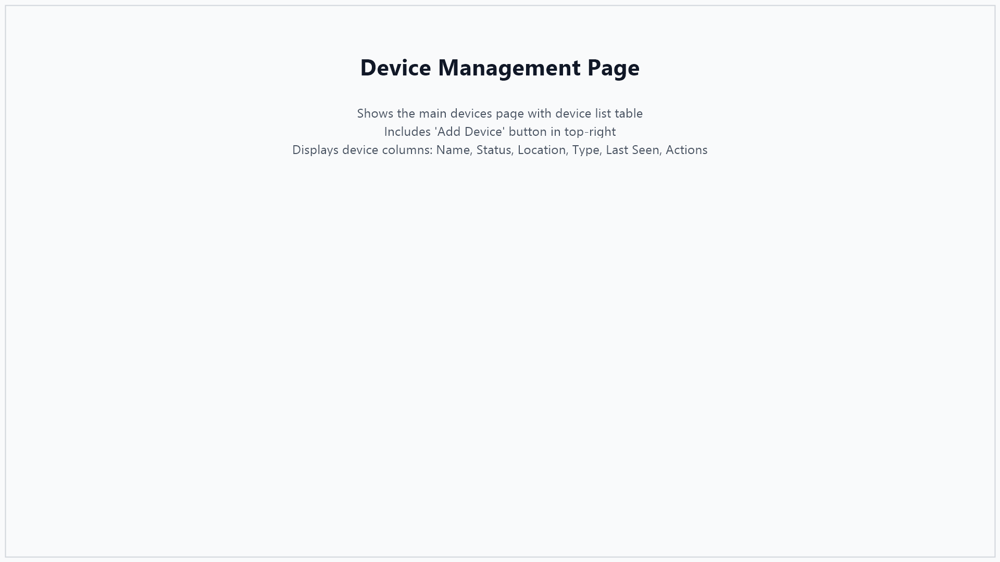

# Screenshot Capture Guide for Sensor Integration Documentation

This guide provides specific instructions for capturing screenshots to complement the **SENSOR_INTEGRATION_GUIDE.md**.

## Prerequisites

Before capturing screenshots, ensure the application is running with sample data:

```bash
# 1. Start Docker services
docker-compose up -d

# 2. Start backend (in one terminal)
./gradlew bootRun

# 3. Start frontend (in another terminal)
cd frontend
npm run dev
```

## Screenshot List

### Screenshot 1: Device Management Page
**File name:** `01-device-management-page.png`
**Location in guide:** Step 1.1 - Navigate to Device Management
**URL:** `http://localhost:3001/devices`

**What to capture:**
- Full browser window showing the Devices page
- Should show the header "Device Management"
- Table with existing devices (if simulator is running, you'll have sample devices)
- "Add Device" button visible in top-right
- Left navigation menu visible

**Setup:**
- Ensure at least 2-3 devices are visible in the table
- Make sure some devices show "ONLINE" status

**Notes:**
- This screenshot shows the main device management interface
- Demonstrates the device list table layout

---

### Screenshot 2: Add Device Modal
**File name:** `02-add-device-modal.png`
**Location in guide:** Step 1.2 - Add a New Device

**What to capture:**
- Click the "+ Add Device" button
- Capture the modal dialog that appears
- Show empty form fields ready for input

**Setup:**
- Click "+ Add Device" button
- Don't fill in any fields yet (show empty form)

**Notes:**
- Shows the form users will use to register new devices
- Highlights all required and optional fields

---

### Screenshot 3: Device Modal Filled
**File name:** `03-device-modal-filled.png`
**Location in guide:** Step 1.3 - Fill in Device Information

**What to capture:**
- Same modal as Screenshot 2, but with sample data filled in
- Example data:
  - Device ID: `sensor-demo-001`
  - Device Name: `Smart Meter - Demo Building`
  - Location: `Building A - Floor 1 - Room 101`
  - Sensor Type: `smart_meter`
  - Firmware Version: `2.1.0`

**Notes:**
- Demonstrates what completed form looks like
- Shows example values for all fields

---

### Screenshot 4: Device List with New Device
**File name:** `04-device-list-with-new.png`
**Location in guide:** Step 1.4 - Save the Device

**What to capture:**
- Devices page after creating a new device
- Highlight the newly created device in the table
- Show its status (likely "UNKNOWN" if no data sent yet)

**Notes:**
- Confirms device was successfully created
- Shows how it appears in the device list

---

### Screenshot 5: Data Ingestion Page
**File name:** `05-data-ingestion-page.png`
**Location in guide:** Step 2.7 - API Endpoint Details / Navigate to Data Ingestion Page
**URL:** `http://localhost:3001/data-ingestion`

**What to capture:**
- Full Data Ingestion page showing both forms:
  - Left: "Full Telemetry Ingestion" form
  - Right: "Single Variable Ingestion" form
- Show the API documentation section at bottom

**Setup:**
- Navigate to "Data Ingestion" in left menu
- Scroll to show both forms and documentation

**Notes:**
- Demonstrates HTTP API ingestion interface
- Shows alternative to MQTT for sending data

---

### Screenshot 6: Data Ingestion Success
**File name:** `06-data-ingestion-success.png`
**Location in guide:** Step 2.8 - Using the Web Interface for Testing

**What to capture:**
- Data Ingestion page with successful response
- Fill in form with sample data:
  - Device ID: `sensor-demo-001` (or any existing device)
  - Add variables: `kwConsumption = 45.5`, `voltage = 220.3`
- Click "Send Telemetry"
- Capture the success message/response

**Notes:**
- Shows successful data ingestion
- Demonstrates the response format

---

### Screenshot 7: Rules Page
**File name:** `07-rules-page.png`
**Location in guide:** Step 3.1 - Navigate to Rules & Automation
**URL:** `http://localhost:3001/rules`

**What to capture:**
- Full Rules & Automation page
- Should show any existing rules (create 1-2 sample rules if none exist)
- "Create Rule" button visible
- Table showing rule name, device, condition, status

**Setup:**
- Navigate to "Rules" in left menu
- If no rules exist, create at least one sample rule first

**Notes:**
- Overview of rules management interface
- Shows list of monitoring rules

---

### Screenshot 8: Create Rule Modal
**File name:** `08-create-rule-modal.png`
**Location in guide:** Step 3.2 - Create a New Rule

**What to capture:**
- Click "+ Create Rule" button
- Capture modal dialog
- Show empty form

**Notes:**
- Displays rule creation form
- Shows all configuration options

---

### Screenshot 9: Create Rule Modal Filled
**File name:** `09-create-rule-filled.png`
**Location in guide:** Step 3.3 - Configure Rule Parameters

**What to capture:**
- Rule creation modal with sample data:
  - Rule Name: `High Power Consumption Alert`
  - Description: `Alert when power exceeds 100kW`
  - Device: Select your test device
  - Variable: `Power Consumption (kW)`
  - Operator: `Greater than (>)`
  - Threshold: `100`
  - Enable immediately: ✓ Checked

**Notes:**
- Example of a complete rule configuration
- Demonstrates typical alert setup

---

### Screenshot 10: Rules List with Active Rules
**File name:** `10-rules-list-active.png`
**Location in guide:** Step 3.5 - Save and Enable the Rule

**What to capture:**
- Rules page showing created rule
- Rule should show as "Enabled" (green toggle)
- Display the condition in the table

**Setup:**
- Create 2-3 different types of rules (high power, low voltage, etc.)
- Ensure at least one is enabled, one disabled

**Notes:**
- Shows how rules appear after creation
- Demonstrates enabled/disabled states

---

### Screenshot 11: Dashboard Overview
**File name:** `11-dashboard-overview.png`
**Location in guide:** Step 4.1 / 4.2 - Access Dashboard / Dashboard Components
**URL:** `http://localhost:3001/` or `http://localhost:3001/dashboard`

**What to capture:**
- Full dashboard page
- Should include:
  - Connection status indicator at top
  - Three stat cards (Total Devices, Online Devices, Total Power)
  - Real-time power consumption chart
  - Grid of device cards below

**Setup:**
- Ensure backend simulator is running to generate data
- Wait for WebSocket connection to show "Open"
- Let some data accumulate in the chart

**Notes:**
- Primary monitoring interface
- Shows all dashboard components

---

### Screenshot 12: Dashboard Status Cards
**File name:** `12-dashboard-status-cards.png`
**Location in guide:** Step 4.2 - Dashboard Components (Status Cards)

**What to capture:**
- Close-up of the three status cards at top of dashboard
- Should clearly show:
  - Total Devices count
  - Online Devices count
  - Total Power consumption

**Notes:**
- Highlights the key metrics summary
- Focus on the statistics cards

---

### Screenshot 13: Real-time Chart
**File name:** `13-realtime-chart.png`
**Location in guide:** Step 4.2 - Dashboard Components (Real-time Chart)

**What to capture:**
- Close-up of the real-time power consumption chart
- Should show live data with multiple lines (one per device)
- Connection status "Open" should be visible

**Setup:**
- Let the application run for 2-3 minutes to get good chart data
- Ensure multiple devices are sending data

**Notes:**
- Demonstrates live data visualization
- Shows WebSocket real-time updates

---

### Screenshot 14: Device Cards Grid
**File name:** `14-device-cards-grid.png`
**Location in guide:** Step 4.2 - Dashboard Components (Device Cards)

**What to capture:**
- Grid of device cards showing different devices
- Should show variety of statuses (ONLINE, OFFLINE if possible)
- Each card displaying latest telemetry values

**Setup:**
- Ensure 3-6 devices are visible
- Show devices with actual data values

**Notes:**
- Individual device status overview
- Shows latest readings per device

---

### Screenshot 15: Single Device Card Detail
**File name:** `15-device-card-detail.png`
**Location in guide:** Step 4.3 - Interpreting Device Cards

**What to capture:**
- Close-up of a single device card showing:
  - Device name and ID
  - Status badge (ONLINE - green)
  - Location
  - Multiple variable values (kW, voltage, current, etc.)
  - "Last seen" timestamp

**Notes:**
- Detailed view of device card layout
- Shows all information displayed per device

---

### Screenshot 16: Alerts Page
**File name:** `16-alerts-page.png`
**Location in guide:** Alert Configuration - Section 5.1 (Access Alerts Page)
**URL:** `http://localhost:3001/alerts`

**What to capture:**
- Alerts page showing triggered alerts
- Should display alerts with different severity levels if possible
- Show alert details: timestamp, device, rule, values, severity

**Setup:**
- Trigger some alerts by sending data that exceeds rule thresholds
- Try to get alerts with different severity levels (LOW, MEDIUM, HIGH)

**Notes:**
- Overview of alerts monitoring
- Shows alert history and details

---

### Screenshot 17: WebSocket Connection Status
**File name:** `17-websocket-status.png`
**Location in guide:** Step 4.4 - Real-Time Updates

**What to capture:**
- Close-up of the connection status indicator at top of dashboard
- Show it in "Open" state (connected)
- Highlight the real-time connection indicator

**Notes:**
- Shows WebSocket connection health
- Important for real-time monitoring

---

## Screenshot Specifications

### Technical Requirements

- **Format:** PNG (preferred) or JPG
- **Resolution:** At least 1920x1080 for full-page screenshots
- **Browser:** Chrome or Edge (for consistency)
- **Window size:** Maximize browser window or use consistent size (1920x1080)
- **Quality:** High quality, no compression artifacts

### Capturing Screenshots

**Windows:**
- `Win + Shift + S` - Snipping tool (selective capture)
- `Win + PrtScn` - Full screen capture
- Use browser DevTools (F12) -> Device toolbar for consistent viewport

**Recommended Tools:**
- Windows Snipping Tool
- ShareX (free, powerful)
- Lightshot
- Greenshot

### Image Optimization

Before adding to documentation:
1. Crop to relevant area (remove unnecessary white space)
2. Optimize file size (use tools like TinyPNG or Squoosh)
3. Add subtle borders if helpful: `border: 1px solid #ccc`
4. Consider adding annotations (arrows, highlights) for complex screenshots

---

## Adding Screenshots to Documentation

### Option 1: Local Images (Recommended for GitHub)

1. Create images directory:
   ```bash
   mkdir -p docs/images
   ```

2. Save screenshots in `docs/images/` folder

3. Update `SENSOR_INTEGRATION_GUIDE.md` by replacing placeholder text:
   ```markdown
   
   ```

### Option 2: Inline in Markdown

For GitHub README or markdown viewers that support it:
```markdown

*Caption: The Device Management page displays all registered IoT devices*
```

---

## Screenshot Checklist

Use this checklist when capturing screenshots:

- [ ] Screenshot 1: Device Management Page
- [ ] Screenshot 2: Add Device Modal (empty)
- [ ] Screenshot 3: Device Modal Filled
- [ ] Screenshot 4: Device List with New Device
- [ ] Screenshot 5: Data Ingestion Page
- [ ] Screenshot 6: Data Ingestion Success
- [ ] Screenshot 7: Rules Page
- [ ] Screenshot 8: Create Rule Modal (empty)
- [ ] Screenshot 9: Create Rule Modal Filled
- [ ] Screenshot 10: Rules List with Active Rules
- [ ] Screenshot 11: Dashboard Overview
- [ ] Screenshot 12: Dashboard Status Cards
- [ ] Screenshot 13: Real-time Chart
- [ ] Screenshot 14: Device Cards Grid
- [ ] Screenshot 15: Single Device Card Detail
- [ ] Screenshot 16: Alerts Page
- [ ] Screenshot 17: WebSocket Connection Status

---

## Testing the Documentation

After adding screenshots:

1. View the documentation in a markdown viewer or GitHub
2. Verify all images load correctly
3. Check that images are properly sized and readable
4. Ensure captions/descriptions match the images
5. Test on mobile view (if documentation will be viewed on mobile)

---

## Quick Start Script

To quickly start the app with sample data for screenshots:

```bash
# Run this script from the project root
#!/bin/bash

echo "Starting SensorVision for screenshot capture..."

# Start Docker services
echo "1. Starting Docker services..."
docker-compose up -d

# Wait for services to be ready
echo "2. Waiting for services to initialize..."
sleep 5

# Start backend with simulator
echo "3. Starting backend (this will run in foreground)..."
echo "   Press Ctrl+C when done capturing screenshots"
echo "   Then start frontend in another terminal with: cd frontend && npm run dev"

# Start backend
./gradlew bootRun
```

Save as `start-for-screenshots.sh` and make executable: `chmod +x start-for-screenshots.sh`

---

## Notes

- Take screenshots in a clean state (no browser extensions visible, no personal data)
- Use consistent browser zoom level (100%)
- Capture during daytime or use light theme for clarity
- Ensure sample data is realistic and representative
- Consider annotating screenshots for clarity (arrows, highlights, labels)

---

**Last Updated:** January 2025
**For:** SENSOR_INTEGRATION_GUIDE.md v1.0
