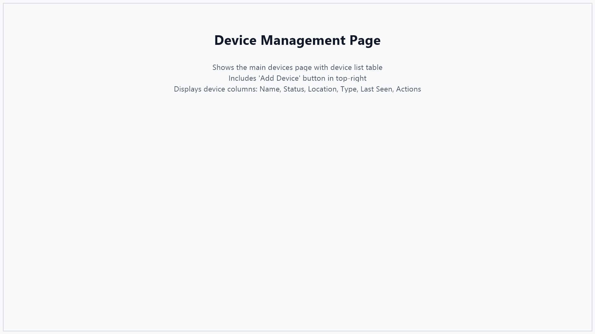
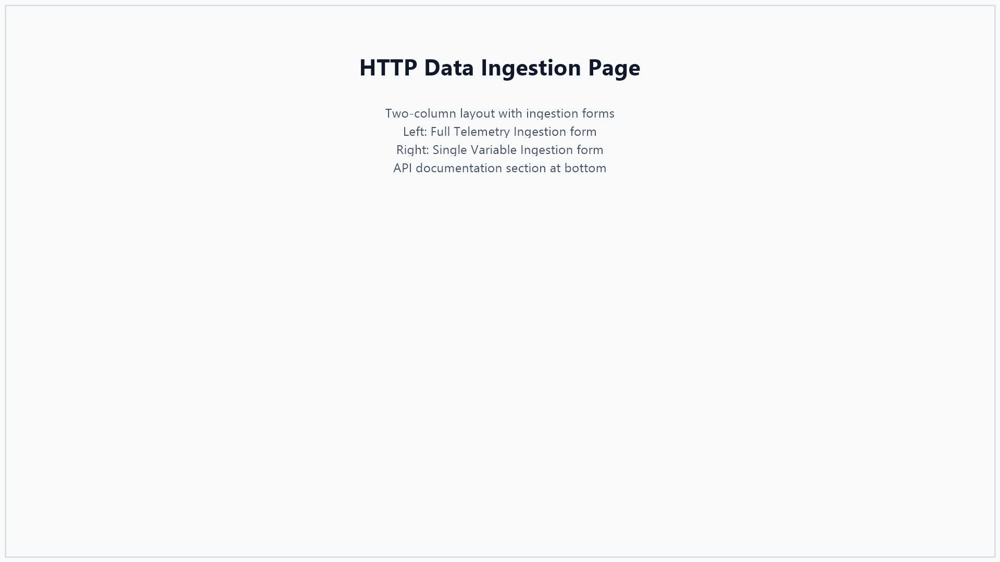
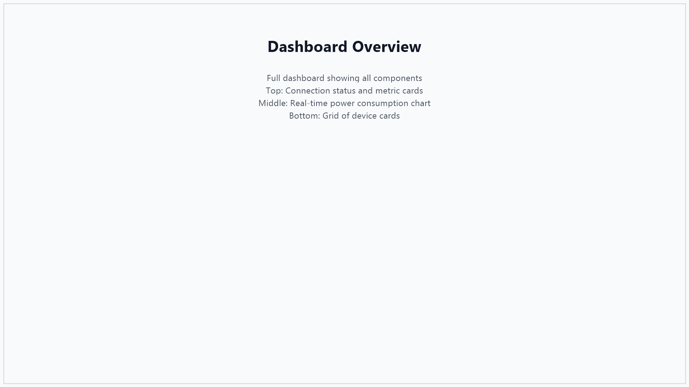

# SensorVision - Sensor Integration Guide

## Table of Contents
1. [Introduction](#introduction)
2. [Overview](#overview)
3. [Quick Start: Adding Your First Sensor](#quick-start)
4. [Step-by-Step Integration Guide](#step-by-step-integration-guide)
   - [Step 1: Register Your Device](#step-1-register-your-device)
   - [Step 2: Configure Data Ingestion](#step-2-configure-data-ingestion)
   - [Step 3: Set Up Monitoring Rules](#step-3-set-up-monitoring-rules)
   - [Step 4: View Real-Time Data](#step-4-view-real-time-data)
5. [Integration Methods](#integration-methods)
   - [MQTT Integration (Recommended)](#mqtt-integration-recommended)
   - [HTTP REST API Integration](#http-rest-api-integration)
6. [Alert Configuration](#alert-configuration)
7. [Troubleshooting](#troubleshooting)
8. [Best Practices](#best-practices)

---

## Introduction

Welcome to the SensorVision Sensor Integration Guide! This document will walk you through the complete process of integrating new IoT sensors into the SensorVision platform for monitoring and alerting.

SensorVision supports multiple types of sensors including:
- Smart meters
- Temperature sensors
- Voltage/current monitors
- Power consumption monitors
- Custom IoT devices

### What You'll Need
- Access to SensorVision web interface
- Sensor device ID (unique identifier)
- Connection credentials (for MQTT or HTTP)
- Basic sensor specifications (type, location, etc.)

---

## Overview

SensorVision uses a simple three-step integration process:

```
┌─────────────────┐      ┌──────────────────┐      ┌─────────────────┐
│   1. Register   │  →   │  2. Send Data    │  →   │  3. Monitor &   │
│     Device      │      │  (MQTT or HTTP)  │      │     Alert       │
└─────────────────┘      └──────────────────┘      └─────────────────┘
```

**Data Flow:**
```
Sensor Device → MQTT/HTTP → SensorVision Platform → Dashboard/Alerts
```

---

## Quick Start

For users who want to get started immediately:

1. **Add Device**: Click "Add Device" button in Device Management
2. **Enter Details**: Provide Device ID, Name, and Location
3. **Send Data**: Use MQTT topic `sensorvision/devices/{deviceId}/telemetry` or HTTP API
4. **Create Rule**: Set up monitoring rules for alerts
5. **Monitor**: View live data on the Dashboard

---

## Step-by-Step Integration Guide

### Step 1: Register Your Device

#### 1.1 Navigate to Device Management

1. Open SensorVision web interface at `http://localhost:3001`
2. Log in with your credentials
3. Click on **"Devices"** in the left navigation menu



*The Device Management page displays all your registered IoT devices with their status, location, and last seen time.*

#### 1.2 Add a New Device

1. Click the **"+ Add Device"** button in the top-right corner
2. A modal dialog will appear


#### 1.3 Fill in Device Information

Complete the following fields in the device registration form:

| Field | Required | Description | Example |
|-------|----------|-------------|---------|
| **Device ID** | Yes | Unique identifier for your sensor (cannot be changed later) | `sensor-001`, `meter-building-a-01` |
| **Device Name** | Yes | Human-readable name for easy identification | `Smart Meter - Building A` |
| **Location** | No | Physical location of the sensor | `Building A - Floor 1 - Room 101` |
| **Sensor Type** | No | Type/model of the sensor | `smart_meter`, `temperature_sensor` |
| **Firmware Version** | No | Current firmware version | `2.1.0` |

**Important Notes:**
- The **Device ID** must be unique across your organization
- Use a consistent naming convention for Device IDs (e.g., `building-floor-room-type-number`)
- Device ID will be used in MQTT topics and API calls

#### 1.4 Save the Device

1. Click the **"Create"** button
2. Your device will appear in the device list with status "UNKNOWN"
3. Status will change to "ONLINE" once data is received


---

### Step 2: Configure Data Ingestion

You can send sensor data to SensorVision using two methods: **MQTT** (recommended) or **HTTP REST API**.

#### Option A: MQTT Integration (Recommended)

MQTT provides real-time, efficient data transmission ideal for IoT devices.

##### 2.1 MQTT Connection Details

```
Broker URL: tcp://localhost:1883
Username: (none - or configured in settings)
Password: (none - or configured in settings)
```

##### 2.2 MQTT Topic Structure

Publish telemetry data to:
```
sensorvision/devices/{deviceId}/telemetry
```

Replace `{deviceId}` with your actual Device ID from Step 1.

**Example Topic:**
```
sensorvision/devices/sensor-001/telemetry
```

##### 2.3 Message Format

Send JSON payloads with the following structure:

```json
{
  "deviceId": "sensor-001",
  "timestamp": "2024-01-15T14:30:00Z",
  "variables": {
    "kwConsumption": 45.5,
    "voltage": 220.3,
    "current": 0.52,
    "powerFactor": 0.95,
    "frequency": 50.0
  }
}
```

**Field Descriptions:**
- `deviceId`: Must match the Device ID registered in Step 1
- `timestamp`: ISO 8601 format timestamp (optional - uses server time if omitted)
- `variables`: Object containing sensor readings as key-value pairs

**Supported Variables:**
- `kwConsumption` - Power consumption in kilowatts
- `voltage` - Voltage in volts
- `current` - Current in amperes
- `powerFactor` - Power factor (0-1)
- `frequency` - Frequency in Hz
- *Custom variables* - You can send any numeric variables

##### 2.4 Testing MQTT Integration

Test your MQTT integration using `mosquitto_pub` command:

```bash
mosquitto_pub -h localhost -p 1883 \
  -t "sensorvision/devices/sensor-001/telemetry" \
  -m '{
    "deviceId": "sensor-001",
    "timestamp": "2024-01-15T14:30:00Z",
    "variables": {
      "kwConsumption": 45.5,
      "voltage": 220.3,
      "current": 0.52
    }
  }'
```

##### 2.5 Verify Data Reception

1. Go to **Dashboard** in the navigation menu
2. Your device should appear with status "ONLINE"
3. You should see the latest readings displayed

---

#### Option B: HTTP REST API Integration

For devices that cannot use MQTT, use the HTTP REST API.

##### 2.6 Navigate to Data Ingestion Page

1. Click on **"Data Ingestion"** in the left navigation menu
2. You'll see two ingestion options: Full Telemetry and Single Variable



##### 2.7 API Endpoint Details

**Base URL:** `http://localhost:8080/api/v1`

**Full Telemetry Endpoint:**
```
POST /api/v1/data/ingest
Content-Type: application/json
```

**Request Body:**
```json
{
  "deviceId": "sensor-001",
  "timestamp": "2024-01-15T14:30:00Z",
  "variables": {
    "kwConsumption": 45.5,
    "voltage": 220.3,
    "current": 0.52
  }
}
```

**Single Variable Endpoint:**
```
POST /api/v1/data/{deviceId}/{variableName}
Content-Type: application/json
```

**Request Body:**
```json
23.5
```

**Example cURL Commands:**

Full telemetry:
```bash
curl -X POST http://localhost:8080/api/v1/data/ingest \
  -H "Content-Type: application/json" \
  -d '{
    "deviceId": "sensor-001",
    "timestamp": "2024-01-15T14:30:00Z",
    "variables": {
      "kwConsumption": 45.5,
      "voltage": 220.3
    }
  }'
```

Single variable:
```bash
curl -X POST http://localhost:8080/api/v1/data/sensor-001/temperature \
  -H "Content-Type: application/json" \
  -d '23.5'
```

##### 2.8 Using the Web Interface for Testing

1. On the **Data Ingestion** page, fill in the form:
   - **Device ID**: Enter your device ID
   - **Timestamp**: Select current time (optional)
   - **Variables**: Add variable name and value pairs
2. Click **"Send Telemetry"**
3. Check the response for success confirmation


---

### Step 3: Set Up Monitoring Rules

Now that your device is sending data, configure automatic monitoring and alerts.

#### 3.1 Navigate to Rules & Automation

1. Click on **"Rules"** in the left navigation menu
2. You'll see the Rules & Automation page


#### 3.2 Create a New Rule

1. Click the **"+ Create Rule"** button in the top-right corner
2. The Create Rule modal will appear


#### 3.3 Configure Rule Parameters

Fill in the rule configuration form:

| Field | Description | Example |
|-------|-------------|---------|
| **Rule Name** | Descriptive name for the alert | `High Power Consumption Alert` |
| **Description** | Optional detailed description | `Alert when power exceeds 100kW` |
| **Device** | Select the device to monitor | `Smart Meter - Building A` |
| **Variable** | Choose which metric to monitor | `Power Consumption (kW)` |
| **Operator** | Comparison operator | `Greater than (>)` |
| **Threshold** | Threshold value to trigger alert | `100` |
| **Enable immediately** | Activate rule right away | ✓ Checked |

**Available Operators:**
- **Greater than (>)**: Triggers when value exceeds threshold
- **Greater than or equal (≥)**: Triggers when value meets or exceeds threshold
- **Less than (<)**: Triggers when value is below threshold
- **Less than or equal (≤)**: Triggers when value is at or below threshold
- **Equal to (=)**: Triggers when value exactly matches threshold

#### 3.4 Example Rule Configurations

**High Power Alert:**
```
Variable: Power Consumption (kW)
Operator: Greater than (>)
Threshold: 100
```

**Low Voltage Warning:**
```
Variable: Voltage (V)
Operator: Less than (<)
Threshold: 210
```

**Overvoltage Protection:**
```
Variable: Voltage (V)
Operator: Greater than (>)
Threshold: 240
```

#### 3.5 Save and Enable the Rule

1. Review your rule configuration
2. Ensure "Enable immediately" is checked
3. Click **"Create"** button
4. The rule will appear in the rules list with status "Enabled"


#### 3.6 Managing Rules

From the Rules page, you can:
- **Toggle Enable/Disable**: Click the toggle icon to activate or deactivate rules
- **Edit Rules**: Click the pencil icon to modify rule parameters
- **Delete Rules**: Click the trash icon to remove rules

---

### Step 4: View Real-Time Data

#### 4.1 Access the Dashboard

1. Click on **"Dashboard"** in the left navigation menu
2. You'll see the real-time monitoring dashboard



#### 4.2 Dashboard Components

The dashboard displays:

**Status Cards (Top Row):**
- **Total Devices**: Count of all registered devices
- **Online Devices**: Number of devices currently sending data
- **Total Power**: Combined power consumption across all devices


**Real-time Chart:**
- Line chart showing power consumption trends
- Updates automatically as new data arrives
- Connection status indicator shows "Open" when receiving live data


**Device Cards:**
- Individual cards for each device
- Shows latest readings for all variables
- Color-coded status indicators:
  - 🟢 **Green (ONLINE)**: Device is actively sending data
  - 🔴 **Red (OFFLINE)**: No recent data received
  - ⚪ **Gray (UNKNOWN)**: Device registered but no data yet


#### 4.3 Interpreting Device Cards

Each device card displays:
- Device name and ID
- Current status badge
- Location information
- Last seen timestamp
- Latest values for all monitored variables

**Example Device Card:**
```
┌─────────────────────────────────┐
│ Smart Meter - Building A        │
│ sensor-001                      │
│ 🟢 ONLINE                       │
│                                 │
│ Power: 45.5 kW                  │
│ Voltage: 220.3 V                │
│ Current: 0.52 A                 │
│                                 │
│ Last seen: 2 seconds ago        │
└─────────────────────────────────┘
```

#### 4.4 Real-Time Updates

- The dashboard uses WebSocket connections for real-time updates
- New data appears immediately without page refresh
- Connection status is shown at the top of the page
- If connection is lost, it will automatically reconnect

---

## Integration Methods

### MQTT Integration (Recommended)

#### Why Choose MQTT?
- ✅ Real-time data streaming
- ✅ Low bandwidth usage
- ✅ Automatic reconnection
- ✅ Quality of Service (QoS) support
- ✅ Ideal for battery-powered devices

#### MQTT Client Libraries

**Python Example:**
```python
import paho.mqtt.client as mqtt
import json
from datetime import datetime

# Configure MQTT client
client = mqtt.Client()
client.connect("localhost", 1883, 60)

# Prepare telemetry data
telemetry = {
    "deviceId": "sensor-001",
    "timestamp": datetime.utcnow().isoformat() + "Z",
    "variables": {
        "kwConsumption": 45.5,
        "voltage": 220.3,
        "current": 0.52
    }
}

# Publish to SensorVision
topic = "sensorvision/devices/sensor-001/telemetry"
client.publish(topic, json.dumps(telemetry))
client.disconnect()
```

**JavaScript/Node.js Example:**
```javascript
const mqtt = require('mqtt');
const client = mqtt.connect('mqtt://localhost:1883');

client.on('connect', () => {
  const telemetry = {
    deviceId: 'sensor-001',
    timestamp: new Date().toISOString(),
    variables: {
      kwConsumption: 45.5,
      voltage: 220.3,
      current: 0.52
    }
  };

  const topic = 'sensorvision/devices/sensor-001/telemetry';
  client.publish(topic, JSON.stringify(telemetry));
  client.end();
});
```

**Arduino/ESP32 Example:**
```cpp
#include <WiFi.h>
#include <PubSubClient.h>
#include <ArduinoJson.h>

const char* mqtt_server = "your-server-ip";
const char* deviceId = "sensor-001";

WiFiClient espClient;
PubSubClient client(espClient);

void publishTelemetry(float kwConsumption, float voltage, float current) {
  StaticJsonDocument<200> doc;
  doc["deviceId"] = deviceId;
  doc["timestamp"] = "2024-01-15T14:30:00Z"; // Use RTC or NTP

  JsonObject variables = doc.createNestedObject("variables");
  variables["kwConsumption"] = kwConsumption;
  variables["voltage"] = voltage;
  variables["current"] = current;

  char buffer[256];
  serializeJson(doc, buffer);

  String topic = "sensorvision/devices/" + String(deviceId) + "/telemetry";
  client.publish(topic.c_str(), buffer);
}
```

#### MQTT Topic Reference

**Telemetry Data (Currently Supported):**
```
sensorvision/devices/{deviceId}/telemetry
```

**Reserved for Future Use:**
```
sensorvision/devices/{deviceId}/status      # Device health/status updates
sensorvision/devices/{deviceId}/commands    # Command/control channel
```

---

### HTTP REST API Integration

#### When to Use HTTP?
- ✅ Simple request/response pattern
- ✅ Works with existing HTTP infrastructure
- ✅ Easy to test with standard tools (curl, Postman)
- ✅ Good for periodic/batch updates

#### Full API Reference

**Authentication:** Not required in current version (configure in production)

**Base URL:** `http://your-server:8080/api/v1`

**Endpoints:**

##### 1. Full Telemetry Ingestion

```http
POST /api/v1/data/ingest
Content-Type: application/json

{
  "deviceId": "sensor-001",
  "timestamp": "2024-01-15T14:30:00Z",
  "variables": {
    "kwConsumption": 45.5,
    "voltage": 220.3,
    "current": 0.52,
    "powerFactor": 0.95,
    "frequency": 50.0
  }
}
```

**Response (200 OK):**
```json
{
  "success": true,
  "message": "Telemetry data ingested successfully",
  "deviceId": "sensor-001",
  "timestamp": "2024-01-15T14:30:00Z"
}
```

##### 2. Single Variable Ingestion

```http
POST /api/v1/data/{deviceId}/{variableName}
Content-Type: application/json

23.5
```

**Example:**
```http
POST /api/v1/data/sensor-001/temperature
Content-Type: application/json

23.5
```

**Response (200 OK):**
```json
{
  "success": true,
  "message": "Variable value ingested successfully",
  "deviceId": "sensor-001",
  "variableName": "temperature",
  "value": 23.5
}
```

#### API Error Codes

| Status Code | Description | Action |
|------------|-------------|---------|
| 200 | Success | Data accepted |
| 400 | Bad Request | Check JSON format and required fields |
| 404 | Device Not Found | Verify Device ID is registered |
| 500 | Server Error | Check server logs, contact administrator |

#### Rate Limiting

**Current Limits:**
- No rate limiting in development mode
- **Production recommendation**: Max 1 request per second per device

#### Batch Ingestion

For sending data for multiple devices:

```http
POST /api/v1/data/ingest/batch
Content-Type: application/json

[
  {
    "deviceId": "sensor-001",
    "timestamp": "2024-01-15T14:30:00Z",
    "variables": { "kwConsumption": 45.5 }
  },
  {
    "deviceId": "sensor-002",
    "timestamp": "2024-01-15T14:30:00Z",
    "variables": { "kwConsumption": 32.1 }
  }
]
```

---

## Alert Configuration

### Understanding the Alert System

#### Alert Flow
```
Data Received → Rule Evaluation → Threshold Check → Alert Triggered → Notification
```

#### Alert Severity Levels

Alerts are automatically assigned severity based on how far the value exceeds the threshold:

| Deviation | Severity | Color |
|-----------|----------|-------|
| 0-20% | LOW | 🟡 Yellow |
| 20-50% | MEDIUM | 🟠 Orange |
| 50%+ | HIGH | 🔴 Red |

**Example:** If threshold is 100 and actual value is 150:
- Deviation: 50%
- Severity: **HIGH**

### Viewing Alerts

#### 5.1 Access Alerts Page

1. Click on **"Alerts"** in the left navigation menu
2. View all triggered alerts


#### 5.2 Alert Information

Each alert displays:
- Alert timestamp
- Device name and ID
- Rule that triggered the alert
- Actual value vs. threshold
- Severity level
- Status (Active/Resolved)

### Alert Cooldown

To prevent alert spam, rules have a **5-minute cooldown period**:
- After an alert is triggered, the same rule won't trigger again for 5 minutes
- This prevents repeated alerts for fluctuating values
- Each rule has an independent cooldown timer

### Future Alert Channels

**Planned for future releases:**
- 📧 Email notifications
- 📱 SMS alerts
- 🔔 Push notifications
- 🔗 Webhook integrations
- 💬 Slack/Teams integration

---

## Troubleshooting

### Device Status Shows "UNKNOWN"

**Symptoms:**
- Device appears in device list
- Status remains "UNKNOWN" or "OFFLINE"

**Solutions:**
1. ✅ Verify Device ID matches exactly (case-sensitive)
2. ✅ Check MQTT topic format: `sensorvision/devices/{deviceId}/telemetry`
3. ✅ Ensure JSON payload is valid
4. ✅ Confirm MQTT broker is running: `docker-compose ps`
5. ✅ Check server logs for errors: `./gradlew bootRun`

### Data Not Appearing on Dashboard

**Symptoms:**
- Device status shows "ONLINE"
- Dashboard shows no data or outdated data

**Solutions:**
1. ✅ Refresh the browser page
2. ✅ Check WebSocket connection status at top of dashboard
3. ✅ Verify variable names match expected values (case-sensitive)
4. ✅ Open browser console (F12) and check for JavaScript errors
5. ✅ Confirm backend is running and accessible

### MQTT Connection Failed

**Symptoms:**
- Cannot publish messages to MQTT broker
- Connection timeout errors

**Solutions:**
1. ✅ Verify MQTT broker is running:
   ```bash
   docker-compose ps mosquitto
   ```
2. ✅ Start MQTT broker if not running:
   ```bash
   docker-compose up -d mosquitto
   ```
3. ✅ Check broker is accessible:
   ```bash
   mosquitto_sub -h localhost -p 1883 -t "test"
   ```
4. ✅ Verify firewall allows port 1883
5. ✅ Check broker logs:
   ```bash
   docker-compose logs mosquitto
   ```

### Rules Not Triggering Alerts

**Symptoms:**
- Data is flowing normally
- Expected threshold is exceeded
- No alerts generated

**Solutions:**
1. ✅ Verify rule is **Enabled** (green toggle in Rules page)
2. ✅ Check variable name matches exactly
3. ✅ Confirm threshold value and operator are correct
4. ✅ Wait 5 minutes if cooldown period is active
5. ✅ Check alerts page to verify alerts aren't being generated but missed
6. ✅ Review backend logs for rule evaluation errors

### HTTP API Returns 404

**Symptoms:**
- POST request to ingestion endpoint returns 404

**Solutions:**
1. ✅ Verify correct base URL: `http://localhost:8080/api/v1`
2. ✅ Check endpoint path is correct
3. ✅ Ensure backend server is running
4. ✅ Confirm port 8080 is not blocked by firewall

### HTTP API Returns 400 (Bad Request)

**Symptoms:**
- Server rejects the payload with 400 error

**Solutions:**
1. ✅ Validate JSON syntax using a JSON validator
2. ✅ Ensure Content-Type header is set: `application/json`
3. ✅ Check required fields are present: `deviceId`, `variables`
4. ✅ Verify numeric values are numbers, not strings
5. ✅ Review error message in response for specific issue

### WebSocket Connection Keeps Disconnecting

**Symptoms:**
- Dashboard shows "Closed" or "Connecting" status
- Real-time updates stop working

**Solutions:**
1. ✅ Check backend is running and healthy
2. ✅ Verify no proxy/firewall blocking WebSocket connections
3. ✅ Check browser console for WebSocket errors
4. ✅ Restart backend server
5. ✅ Clear browser cache and reload page

---

## Best Practices

### 1. Device Naming Conventions

**Use consistent, hierarchical naming:**
```
✅ Good Examples:
- building-a-floor-1-meter-01
- sensor-warehouse-temperature-001
- pump-station-3-pressure-sensor

❌ Avoid:
- device1
- test
- temp
```

**Benefits:**
- Easy to identify devices
- Simplifies filtering and searching
- Clearer in reports and alerts

### 2. Data Transmission Frequency

**Recommended intervals:**

| Sensor Type | Recommended Interval | Reasoning |
|-------------|---------------------|-----------|
| Smart Meters | 10-30 seconds | Balance real-time monitoring with bandwidth |
| Temperature | 1-5 minutes | Slow-changing values don't need high frequency |
| Critical Systems | 5-10 seconds | Fast response for safety-critical monitoring |
| Battery-Powered | 5-15 minutes | Conserve battery life |

**Avoid:**
- ❌ Sending data more than once per second (creates unnecessary load)
- ❌ Intervals longer than 15 minutes (may miss important events)

### 3. Variable Naming

**Use camelCase for consistency:**
```javascript
✅ Recommended:
{
  "kwConsumption": 45.5,
  "voltage": 220.3,
  "powerFactor": 0.95
}

❌ Avoid mixing styles:
{
  "kw_consumption": 45.5,  // snake_case
  "Voltage": 220.3,         // PascalCase
  "power-factor": 0.95      // kebab-case
}
```

### 4. Error Handling

**Implement retry logic:**

```python
import time

def publish_with_retry(client, topic, message, max_retries=3):
    for attempt in range(max_retries):
        try:
            result = client.publish(topic, message)
            if result.rc == 0:
                return True
            time.sleep(2 ** attempt)  # Exponential backoff
        except Exception as e:
            print(f"Attempt {attempt + 1} failed: {e}")
            if attempt < max_retries - 1:
                time.sleep(2 ** attempt)
    return False
```

### 5. Data Validation

**Validate data before sending:**

```python
def validate_telemetry(data):
    # Check required fields
    if 'deviceId' not in data or 'variables' not in data:
        return False

    # Validate variable values
    for key, value in data['variables'].items():
        if not isinstance(value, (int, float)):
            return False

        # Sanity checks for your domain
        if key == 'voltage' and (value < 0 or value > 500):
            return False
        if key == 'kwConsumption' and value < 0:
            return False

    return True
```

### 6. Security Recommendations

**For production deployments:**

1. **Authentication:**
   - Enable MQTT username/password
   - Use API keys for HTTP endpoints
   - Implement OAuth2 for web interface

2. **Encryption:**
   - Use MQTT over TLS (port 8883)
   - Enable HTTPS for web interface
   - Encrypt sensitive data at rest

3. **Network Security:**
   - Restrict MQTT broker to trusted networks
   - Use firewall rules to limit access
   - Implement rate limiting

4. **Device Security:**
   - Store credentials securely on devices
   - Implement device certificate authentication
   - Regular firmware updates

### 7. Testing New Integrations

**Step-by-step testing checklist:**

- [ ] 1. Register device in web interface
- [ ] 2. Test data ingestion with manual curl/MQTT command
- [ ] 3. Verify data appears on dashboard
- [ ] 4. Create a test rule with low threshold
- [ ] 5. Trigger rule by sending data above threshold
- [ ] 6. Confirm alert appears in Alerts page
- [ ] 7. Monitor for 15-30 minutes to ensure stability
- [ ] 8. Check device status remains "ONLINE"

### 8. Monitoring and Maintenance

**Regular maintenance tasks:**

- **Daily:**
  - Check dashboard for offline devices
  - Review new alerts

- **Weekly:**
  - Verify all critical devices are online
  - Review alert patterns for anomalies

- **Monthly:**
  - Check database size and performance
  - Review and update rules as needed
  - Archive old telemetry data if needed

### 9. Scalability Considerations

**Planning for growth:**

| Metric | Small Deployment | Medium Deployment | Large Deployment |
|--------|------------------|-------------------|------------------|
| Devices | < 50 | 50-500 | 500+ |
| Data points/sec | < 10 | 10-100 | 100+ |
| Database | PostgreSQL (default) | PostgreSQL + Indexing | TimescaleDB/InfluxDB |
| MQTT Broker | Mosquitto (default) | Mosquitto + tuning | EMQX/HiveMQ |

**Optimization tips:**
- Use batch ingestion for multiple devices
- Implement data aggregation for historical data
- Consider time-series database for large deployments
- Use MQTT QoS 1 for important messages, QoS 0 for high-frequency data

### 10. Documentation

**Maintain documentation for your deployment:**

```
my-sensorvision-deployment/
├── devices.md              # List of all devices and their IDs
├── rules.md                # Configured monitoring rules
├── variables.md            # Custom variables and units
├── alert-procedures.md     # What to do when alerts trigger
└── maintenance-log.md      # Record of changes and updates
```

---

## Additional Resources

### API Documentation
- **Swagger UI:** http://localhost:8080/swagger-ui.html
- Complete API reference with interactive testing

### Monitoring
- **Grafana Dashboard:** http://localhost:3000
  - Username: admin
  - Password: admin
- **Prometheus Metrics:** http://localhost:9090

### Support
- **GitHub Issues:** [Report bugs and feature requests]
- **Documentation:** Check README.md for architecture details
- **CLAUDE.md:** Development guidelines and technical details

---

## Quick Reference Card

### Essential Endpoints

```
Web Interface:    http://localhost:3001
Backend API:      http://localhost:8080/api/v1
Swagger Docs:     http://localhost:8080/swagger-ui.html
MQTT Broker:      mqtt://localhost:1883
```

### MQTT Quick Command

```bash
# Publish test data
mosquitto_pub -h localhost -p 1883 \
  -t "sensorvision/devices/YOUR_DEVICE_ID/telemetry" \
  -m '{"deviceId":"YOUR_DEVICE_ID","variables":{"kwConsumption":45.5}}'
```

### HTTP Quick Command

```bash
# Post telemetry via HTTP
curl -X POST http://localhost:8080/api/v1/data/ingest \
  -H "Content-Type: application/json" \
  -d '{"deviceId":"YOUR_DEVICE_ID","variables":{"kwConsumption":45.5}}'
```

### Docker Commands

```bash
# Start all services
docker-compose up -d

# Check status
docker-compose ps

# View logs
docker-compose logs -f

# Stop all services
docker-compose down
```

---

## Appendix: Example Integration Scenarios

### Scenario 1: Smart Meter Integration

**Requirements:**
- Monitor power consumption, voltage, current
- Alert when power exceeds 100 kW
- Data every 30 seconds

**Steps:**
1. Register device: `meter-building-a-01`
2. Configure MQTT client on meter
3. Send data every 30 seconds with `kwConsumption`, `voltage`, `current`
4. Create rule: `kwConsumption > 100`
5. Monitor on dashboard

### Scenario 2: Temperature Sensor Array

**Requirements:**
- 10 temperature sensors in warehouse
- Alert when any sensor exceeds 30°C
- Data every 5 minutes

**Steps:**
1. Register 10 devices: `warehouse-temp-01` through `warehouse-temp-10`
2. Each sensor sends temperature reading every 5 minutes
3. Create rule for each device: `temperature > 30`
4. View all sensors on dashboard

### Scenario 3: Industrial Pump Monitoring

**Requirements:**
- Monitor pressure, flow rate, temperature
- Alert on pressure < 2 bar or > 10 bar
- Alert on temperature > 80°C
- Real-time monitoring (10-second intervals)

**Steps:**
1. Register device: `pump-station-3-main-pump`
2. Send `pressure`, `flowRate`, `temperature` every 10 seconds
3. Create rules:
   - `pressure < 2` (Low pressure)
   - `pressure > 10` (High pressure)
   - `temperature > 80` (Overheat)
4. Monitor critical pump on dashboard

---

**Document Version:** 1.0
**Last Updated:** January 2025
**Compatibility:** SensorVision v1.0+

---

For technical implementation details and development guidelines, see [CLAUDE.md](CLAUDE.md) and [README.md](README.md).
